## Diploma Engineering

## Laboratory Manual

## (Database Management System) (DI04032011)

## [ICT Engineering, Semester IV]

Enrolment No

Name

Branch

Academic Term

Institute


## Directorate of Technical Education Gandhinagar - Gujarat

DBMS (DI04032011)

## DTE's Vision:

To provide globally competitive technical education;

Remove geographical imbalances and inconsistencies;

Develop student friendly resources with a special focus on girls' education and support to weaker sections;

Develop programs relevant to industry and create a vibrant pool of technical professionals.

Institute's Vision:

Institute's Mission:

Department's Vision:

Department's Mission:

## Certificate

This       is       to       certify       that       Mr./Ms      … . . . … … … … … … … … . . …………….Enrollment

No………………………………… of 4 TH  Semester of Information and Communication technology

of \_\_\_\_\_\_\_\_\_\_\_\_\_\_\_\_\_\_\_\_\_\_\_\_\_\_\_\_\_\_\_\_\_\_\_\_\_ has satisfactorily completed the term work in course

Database  Management  System  (DI04032011)  for  the  academic  year:  \_\_\_\_\_\_\_\_\_\_\_\_\_\_\_\_\_\_\_\_\_\_\_

Term: Odd/Even  prescribed in the GTU curriculum.

Place:…………………..

Date: …………………..

Signature of Course Faculty

Head of the Department

DBMS (DI04032011)

## Preface

The primary aim of any laboratory/Practical/field work is enhancement of required skills as well as creative ability amongst students to solve real time problems by developing relevant competencies in psychomotor  domain.  Keeping  in  view,  GTU  has  designed  competency  focused  outcome-based curriculum -2021 (COGC-2021) for Diploma engineering programmes. In this more time is allotted to practical work than theory. It shows importance of enhancement of skills amongst students and it pays attention to utilize every second of time allotted for practical amongst Students, Instructors and Lecturers to achieve relevant outcomes by performing rather than writing practice in study type. It is essential for effective  implementation  of  competency  focused  outcome-  based  Green  curriculum-2021.  Every practical has been keenly designed to serve as a tool to develop &amp; enhance relevant industry needed competency in each and every student. These psychomotor skills are very difficult to develop through traditional chalk and board content delivery method in the classroom. Accordingly, this lab manual has been designed to focus on the industry defined relevant outcomes, rather than old practice of conducting practical to prove concept and theory.

By using this lab manual, students can read procedure one day in advance to actual performance day  of  practical  experiment  which  generates  interest  and  also,  they  can  have  idea  of  judgement  of magnitude prior to performance. This in turn enhances predetermined outcomes amongst students. Each and every Experiment /Practical in this manual begins by competency, industry relevant skills, course outcomes as well as practical outcomes which serve as a key role for doing the practical. The students will also have a clear idea of  safety and necessary precautions to be taken while performing experiment.

This manual also provides guidelines to lecturers to facilitate student-centered lab activities for each practical/experiment by arranging and managing necessary resources in order that the students follow the procedures with required safety and necessary precautions to achieve outcomes. It also gives an idea that how students will be assessed by providing Rubrics.

Internet is widely used in different areas such as banking, e-commerce, education and many others. Different technologies are used to develop web applications but HTML is the core component in all types of applications for formatting and presenting the web content. This course will impart skill sets related to designing HTML web pages, using cascading style sheets and embedding Java script using Kompozer.  This  course  will  also  serve  as  a  pre-requisite  for  the  advanced  web  development technologies, which students will learn in the upcoming semester.

## Programme Outcomes (POs) :

1. Basic and Discipline specific knowledge: Apply knowledge of basic mathematics, science and  engineering  fundamentals  and  engineering  specialization  to  solve  the engineering problems.
2. Problem analysis : Identify and analyse well-defined engineering problems using codified  standard methods.
3. Design/ development of solutions: Design solutions for engineering well-defined technical  problems and assist with the design of systems components or processes to meet specified needs.
4. Engineering Tools, Experimentation and Testing: Apply modern engineering tools and  appropriate technique to conduct standard tests and measurements.
5. Engineering practices  for  society,  sustainability  and  environment: Apply appropriate technology  in  context  of  society,  sustainability,  environment  and ethical practices.
6. Project Management: Use engineering management principles individually, as a team member or a leader to manage projects and effectively communicate about well-defined  engineering activities.
7. Life-long learning: Ability to analyze individual needs and engage in updating in the context  of technological changes in field of engineering.

## Practical Outcome - Course Outcome matrix

## Course Outcomes (COs):

CO1: Understand  the  fundamental  concepts  of  database  systems  and  role  of databases  in  sustainable  development  and  identify  eco-friendly  practices  in database systems

- CO2: Design database using Entity Relationship approach
- CO3: Manage and Implement database using SQL
- CO4: Apply concepts of normalization to design an optimal database.
- CO5: Explain transaction management concepts  for concurrent use of database.

|    | S. No.  Practical Outcome/Title of  experiment                                                                                                                                                                 | CO 1   | CO 2   | CO 3   | CO 4   | CO 5   |
|----|----------------------------------------------------------------------------------------------------------------------------------------------------------------------------------------------------------------|--------|--------|--------|--------|--------|
|  1 | Basics of Database, its applications and  Data Models   a. Prepare a report on Current Database  Trends.   b. Prepare a list of most famous  websites and Mobile Applications with  Database Tools used in it. | √      |        |        |        |        |
|  2 | Prepare ER diagram for Library  Management System and convert it to  relational schema                                                                                                                         |        | √      |        |        |        |
|  3 | Implement SQL queries to perform  various DDL Commands.                                                                                                                                                        |        | -      | √      | -      |        |
|  4 | a. Implement SQL queries to perform  various DML Commands.   b. Retrieve data using SELECT  command and various SQL operators.                                                                                 |        | -      | √      | -      |        |
|  5 | Implement SQL queries using Date  functions like add-months, months- between, round, nextday, truncate etc.                                                                                                    |        | -      | √      | -      |        |
|  6 | Implement SQL queries using Numeric  functions like abs, ceil, power, mod,  round, trunc, sqrt etc. and Character  Functions like initcap, lower, upper,  ltrim, rtrim, replace, substring, instr etc.         |        | -      | √      | -      |        |
|  7 | Implement SQL queries using  Conversion Functions like to- char, to- date, to-number and Group functions  like Avg, Min, Max, Sum, Count,  Decode etc.                                                         | -      |        | √      | -      |        |
|  8 | Implement SQL queries using Set  operators like Union, union all,  Intersect, Minus etc.                                                                                                                       | -      |        | √      | -      |        |

|   9. | Retrieve data spread across various  tables or same  table using various Joins.                              |    |    | √   |    |    |
|------|--------------------------------------------------------------------------------------------------------------|----|----|-----|----|----|
|   10 | Perform queries to Create, alter and  update views                                                           | -  | -  | √   | -  |    |
|   11 | Implement SQL queries for CREATE  USER, GRANT,REVOKE and DROP  USER command.                                 | -  | -  | √   | -  | -  |
|   12 | Implement Practical-1 again with  Domain Integrity, Entity Integrity and  Referential Integrity constraints. | -  | -  | √   | -  | -  |
|   13 | Perform Various Normalization forms  on any database.                                                        | -  | -  | -   | √  | -  |
|   14 | Perform SQL queries for  TCL(Transaction Control Language) and  DCL(Data Control Laguage) Commands.          | -  | -  | -   | -  | √  |

## Guidelines to Course Faculty

1. Couse faculty should demonstrate experiment with all necessary implementation strategies described in curriculum.
2. Couse faculty should explain industrial relevance before starting of each experiment.
3. Course faculty should involve &amp; give opportunity to all students for hands on experience.
4. Course faculty should ensure mentioned skills are developed in the students by asking.
5. Utilise 2 hrs of lab hours effectively and ensure completion of write up with quiz also.
6. Encourage peer to peer learning by doing same experiment through fast learners.

## Instructions for Students

1. Organize the work in the group and make record of all observations.
2. Students shall develop maintenance skill as expected by industries.
3. Student shall attempt to develop related hand-on skills and build confidence.
4. Student  shall  develop  the  habits  of  evolving  more  ideas,  innovations, skills etc.
5. Student shall refer technical magazines and data books.
6. Student should develop habit to submit the practical on date and time.
7. Student should well prepare while submitting write-up of exercise.

DBMS (DI04032011)

## Enrolment No:

## Continuous Assessment Sheet

Name

Term:

|   Sr no | Practical Outcome/Title of experiment                                                                                                                                                                         | Page   | Date   | Marks  (10)   | Sign   |
|---------|---------------------------------------------------------------------------------------------------------------------------------------------------------------------------------------------------------------|--------|--------|---------------|--------|
|       1 | Basics of Database, its applications and Data  Models   a. Prepare a report on Current Database Trends.   b. Prepare a list of most famous websites and  Mobile Applications with Database Tools used in  it. |        |        |               |        |
|       2 | Prepare ER diagram for Library Management  System and convert it relational schema                                                                                                                            |        |        |               |        |
|       3 | Implement SQL queries to perform various  DDL Commands.                                                                                                                                                       |        |        |               |        |
|       4 | a. Implement SQL queries to perform various  DML Commands.   b. Retrieve data using SELECT command and  various SQL operators.                                                                                |        |        |               |        |
|       5 | Implement SQL queries using Date functions  like add-months, months-between, round,  nextday, truncate etc.                                                                                                   |        |        |               |        |
|       6 | Implement SQL queries using Numeric  functions like abs, ceil, power, mod, round,  trunc, sqrt etc. and Character Functions like  initcap, lower, upper, ltrim, rtrim, replace,  substring, instr etc.        |        |        |               |        |
|       7 | Implement SQL queries using Conversion  Functions like to- char, to-date, to-number and  Group functions like Avg, Min, Max, Sum,  Count, Decode etc.                                                         |        |        |               |        |
|       8 | Implement SQL queries using Set operators like  Union, union all, Intersect, Minus etc.                                                                                                                       |        |        |               |        |
|       9 | Retrieve data spread across various tables or  same table using various Joins.                                                                                                                                |        |        |               |        |
|      10 | Perform queries to Create, alter and update views                                                                                                                                                             |        |        |               |        |
|      11 | Implement SQL queries for CREATE USER,  GRANT,REVOKE and DROP USER command.                                                                                                                                   |        |        |               |        |

DBMS (DI04032011)

|   12. | Implement Practical-3 again with Domain  Integrity, Entity Integrity and Referential Integrity  constraints.   |
|-------|----------------------------------------------------------------------------------------------------------------|
|    13 | Perform Various Normalization forms on any  database.                                                          |
|    14 | Perform SQL queries for TCL(Transaction Control  Language) and DCL(Data Control Laguage)  Commands.            |

Total

Practical No.1:

Date: \_\_\_\_\_\_\_\_\_\_\_\_\_\_\_\_\_

Basics of Database, its applications and Data Models

- a. Prepare a report on Current Database Trends.
- b. Prepare a list of most famous websites and Mobile Applications with Database Tools used in it.

## A. Objective:

DBMS helps to understand how data is stored, organized, and accessed in computer systems, and its applications in managing large amounts of information efficiently through the use of data models.

## B. Expected Program Outcomes (POs)

Basic and Discipline specific knowledge: Apply knowledge of basic mathematics, science and  engineering  fundamentals  and  engineering  specialization  to  solve  the  engineering problems.

## C. Expected Skills to be developed based on competency:

'Design database for a given application'

This practical is expected to develop the following skills.

1. Development of research and technical skills about database.
2. Understanding the technical aspects of database systems.

## D. Expected Course Outcomes(Cos)

CO1:- Understand the fundamental concepts of database systems and role of databases in sustainable development and identify eco-friendly practices in database systems

## E. Practical Outcome(PRo)

Students will be able understand recent database trends and tools.

## F. Expected Affective domain Outcome(ADos)

1. Follow safety practices.
2. Increased appreciation and enthusiasm for the importance of databases in modern technology and business.
3. Follow ethical practices.

## G. Prerequisite Theory:

What is Data?

Data refers to the raw facts and figures that are collected and stored for future use. It can be in any form text,

## What is Information?

Information is the meaningful interpretation of data. It is the output that is obtained after processing the data to extract meaning from it.

## What is DBMS?

DBMS stands for Database Management System. It is a software  system that allows users to create, maintain, and manage databases.

## What is Metadata?

Metadata refers to the data that describes other data. It provides information about the structure, content, and context of data.

## What are Data Items?

Data items are the smallest unit of information in a database. They represent a single fact or piece of information.

## What are Fields?

Fields are the  columns or attributes  of a  table in a database. They represent the different types of information that can be stored in a table.

## What are Records?

Records are the rows or instances of a table in a database. They represent a collection of related data items.

## What is a Data Dictionary?

A data dictionary is a centralized repository that stores metadata about the data elements and data structures in a database. It provides information about the data types,  relationships,  constraints, and other properties of the database.

## What is a Schema in DBMS?

A schema is a logical structure that defines how data is organized and stored in a database. It includes the description of tables, attributes, relationships,  and constraints.

## What is a Sub-schema?

A sub-schema is a subset of the schema that describes the part of the database that is relevant to a particular user or group of users. It provides a view of the database that is tailored to the needs of the user.

## What is an Instance in DBMS?

An instance is a snapshot of the data stored in a database at a particular point in time.  It includes all the data values for the tables and records in the database. An instance is also referred to as a database state or database snapshot.

## DBMS Architecture

The DBMS design depends upon its architecture. The basic client/server architecture  is used to deal with a large number of PCs, web servers, database servers and other components that are connected with networks.

The client/server architecture consists of many PCs and a workstation which are connected via the network. DBMS architecture depends upon how users are connected to the database to get their request done.

-  Types of DBMS Architecture

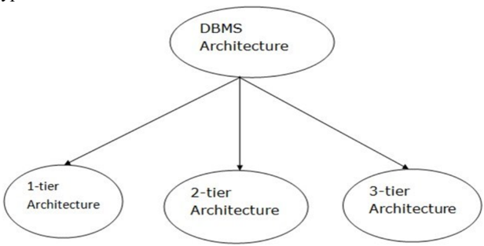

Database architecture can be seen as a single tier or multi-tier. But logically, database architecture is of two types like: 2-tier architecture and 3-tier architecture.

## o 1-Tier Architecture

In this architecture, the database is directly available to the user. It means the user can directly sit on the DBMS and uses it. Any changes done here will  directly  be  done  on the  database  itself.  It  doesn't  provide  a  handytool for end users. The 1-Tier architecture is  used  for  development  of  the  local  application,  where  programmers  can  directly communicate with the database for the quick response.

## o 2-Tier Architecture

The 2-Tier architecture is same as basic client-server. In the two-tier architecture, applications on the client end can directly communicate with the database at the server side. The user interfaces and application programs are run on the client-side. The server side is responsible to provide the functionalities like: query processing and transaction management.  To  communicate  with  the  DBMS,  client-side  application  establishes  a connection with the server side.

Fig: 2-tier Architecture

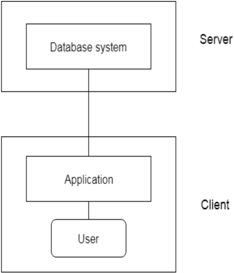

## o 3-Tier Architecture

The 3-Tier architecture contains another layer between the client and server. In this architecture, client can't directly communicate with the server. The application on the clientend  interacts  with  an  application  server  which  further  communicates  with  the  database system. End user has no idea about the existence of the database beyond the application server. The database also has no idea about any other user beyond the application. The 3Tier architecture is used in case of large web application.

Fig: 3-tier Architecture

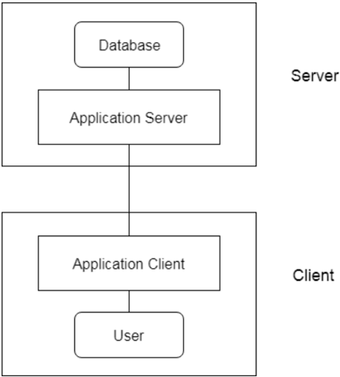

## H. Resources/Equipment Required

|   Sr.  No. | Instrument/Equipment/  Components/Trainer kit   | Specification                                                                         | Specification                                                                         | Specification                                                                         | Specification                                                                         | Quantity            |
|------------|-------------------------------------------------|---------------------------------------------------------------------------------------|---------------------------------------------------------------------------------------|---------------------------------------------------------------------------------------|---------------------------------------------------------------------------------------|---------------------|
|          1 |                                                 | Hardware: Computer System  Computer (i3-i5 preferable), RAM minimum 2  GB and onwards | Hardware: Computer System  Computer (i3-i5 preferable), RAM minimum 2  GB and onwards | Hardware: Computer System  Computer (i3-i5 preferable), RAM minimum 2  GB and onwards | Hardware: Computer System  Computer (i3-i5 preferable), RAM minimum 2  GB and onwards | As Per  Batch  Size |
|          2 | Operating System                                | Windows/ Linux                                                                        | Windows/ Linux                                                                        | Windows/ Linux                                                                        | Windows/ Linux                                                                        | As Per  Batch  Size |
|          3 | Software                                        | Oracle                                                                                | Oracle                                                                                | Oracle                                                                                | Oracle                                                                                | As Per  Batch  Size |
|          4 | Text Editor                                     | Notepad,  similar                                                                     | Notepad++,                                                                            | Sublime                                                                               | or                                                                                    | As Per  Batch  Size |

- I.
- Safety and necessary Precautions followed NA
- J. Report:
- a. Prepare a report on Current Database Trends.

DBMS (DI04032011)

- b. Famous Websites and Mobile Applications with Database Tools Used

.

## K. Practical related Quiz.

\_\_\_\_\_\_\_\_\_\_\_\_\_\_\_\_\_\_\_\_\_\_\_

- 1) DBMS stands for
- 2) What is Meta Data?
- 3) What is schema?
- 4) A schema is a logical structure that defines how the data is organized in a database, including tables, fields, relationships, and constraints
- 5) In single-tier architecture tier, the database is directly available to the user.

## L. References / Suggestions

1. https://www.w3schools.com/sql/default.asp
2. https://www.tutorialspoint.com/dbms/
3. https://www.geeksforgeeks.org/dbms/

## M. Assessment-Rubrics

| Excellent  (18-20  Marks)                                                                                                | Good (13-17 Marks)                                                                                                                                   | Satisfactory  (7-12  Marks)                                                                                                   | Fair (0-6 Marks)                                                                                                          |
|--------------------------------------------------------------------------------------------------------------------------|------------------------------------------------------------------------------------------------------------------------------------------------------|-------------------------------------------------------------------------------------------------------------------------------|---------------------------------------------------------------------------------------------------------------------------|
|  Student  executes  the  queries  with  correct output.    Student submits  the lab report in  specified  time  limit. |  Student executes the  queries  having  correct  output  with  external guidance.    Student  submits  the  lab  report  in  specified time limit. |  Student executes  the  queries  with  incorrect output.    Student  submits  the  lab  report  in  specified  time  limit. |  Student is not able to  execute the queries.    Student  does  not  submit the lab report  in  specified  time  limit. |

Sign with Date

## Practical No.2:

Design an E-R diagram for a library management system and convert it to relational schema

## Objective:

-  E-R  diagrams  provide  a  high-level  view  of  the  database's  purpose  and requirements, ER diagrams provide a detailed view of the database's structure and relationships. Both are essential tools in database design and development
-  To reduce data redundancy, minimize the possibility of data inconsistencies, and improve  the  performance  of  the  database.  By  following  the  principles  of normalization, you can create a database that is more organized, efficient, and easier to maintain over time.

## A. Expected Program Outcomes (POs):

1. Basic and Discipline specific knowledge: Apply knowledge of basic mathematics, science and engineering fundamentals and engineering specialization to solve the Computer Engineering problems.
2. Problem analysis: Identify and analyse well-defined Computer Engineering problems using codified standard methods.
3. Design/development of solutions: Design solutions for Computer Engineering well-defined technical problems and assist with the design of systems components or processes to meet specified needs.
4. Engineering Tools, Experimentation and Testing: Apply modern Computer Engineering tools and appropriate technique to conduct standard tests and measurements.
5. Life-long learning: Ability to analyse individual needs and engage in updating in the context of technological changes in field of engineering.

## B. Expected Skills to be developed based on competency:

-  E-R diagramming skills can improve data modeling, problem-solving, communication, analytical, and technical skills, all of which are essential in the field of database design and management
-  Ability to analyze data and identify relationships between different data points.
-  Understanding of normalization rules and techniques for organizing data in a database.

-  Proficiency in designing and implementing a normalized database schema to ensure data consistency and eliminate redundancies.

## C. Expected Course Outcomes(Cos)

Apply various Normalization techniques

## D. Practical Outcome(PRo)

-  E-R diagram used in data modeling, database design, communication, maintenance, and optimization.
-  Normalization can improve the efficiency, consistency, flexibility, and maintenance of a database.

## E. Expected Affective domain Outcome (ADos)

-  Follow safety practices.
-  Practice good housekeeping.
-  Demonstrate working as a leader/a team member.
-  Maintain tools and equipment
-  Follow ethical practices.

## F. Prerequisite Theory:

-  The Entity Relational Model is a model for identifying entities to be represented in the database and representation of how those entities are related. The ER data model specifies enterprise schema that represents the overall logical structure of a database graphically.
-  The Entity Relationship Diagram explains the relationship among the entities present in the database. ER models are used to model real-world objects like a person, a car, or  a  company  and  the  relation  between  these  real-world  objects.  In  short,  ER Diagram is the structural format of the database.

ER Model is used to model the logical view of the system from a data perspective which consists of these symbols:

## Entity

Entities  are  represented  by  means  of  rectangles.  Rectangles  are  named  with  the  entity  set  they represent.


Attributes

Attributes  are  the  properties  of  entities.  Attributes  are  represented  by  means  of  ellipses.  Every ellipse represents one attribute and is directly connected to its entity (rectangle).


If the attributes are composite , they are further divided in a tree like structure. Every node is then connected to its attribute. That is, composite attributes are represented by ellipses that are connected with an ellipse.

Multivalued attributes are depicted by double ellipse.

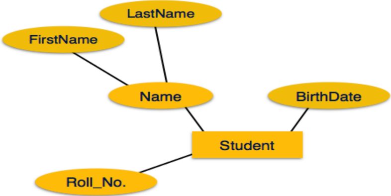

Derived attributes are depicted by dashed ellipse.


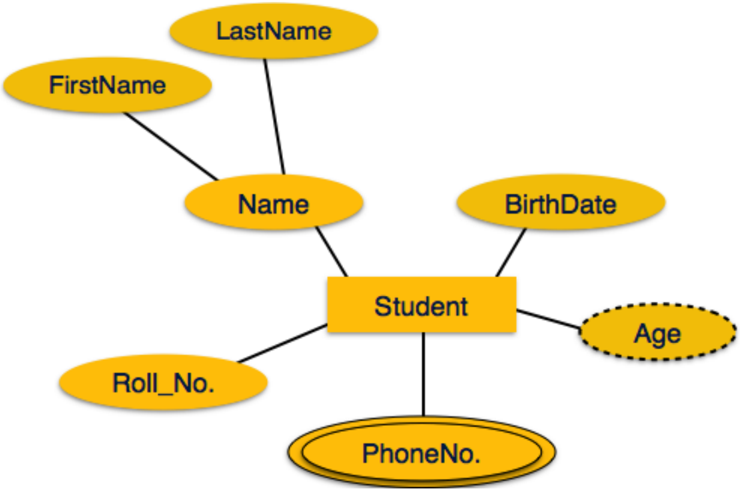

## Relationship

Relationships are represented by diamond-shaped box. Name of the relationship is written inside the diamond-box. All the entities (rectangles) participating in a relationship, are connected to it by a line.

## Binary Relationship and Cardinality

A relationship where two entities are participating is called a binary relationship . Cardinality is the number of instance of an entity from a relation that can be associated with the relation.

-  One-to-one - When only one instance of an entity is associated with the relationship, it is marked as '1:1'. The following image reflects that only one instance of each entity should be associated with the relationship. It depicts one-to-one relationship.
-  One-to-many -  When  more  than  one  instance  of  an  entity  is  associated  with  a relationship, it is marked as '1:N'. The following image reflects that only one instance of  entity  on  the  left  and  more  than  one  instance  of  an  entity  on  the  right  can  be associated with the relationship. It depicts one-to-many relationship.

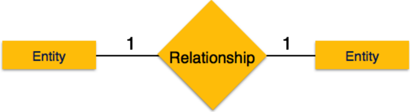

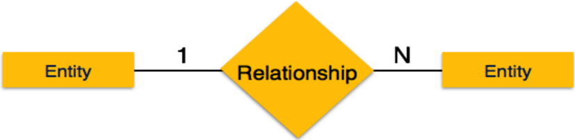

-  Many-to-one -  When  more  than  one  instance  of  entity  is  associated  with  the relationship, it is marked as 'N:1'. The following image reflects that more than one instance of an entity on the left and only one instance of an entity on the right can be associated with the relationship. It depicts many-to-one relationship.
-  Many-to-many -  The following image reflects that more than one instance of an entity on the left and more than one instance of an entity on the right can be associated with the relationship. It depicts many-to-many relationship.

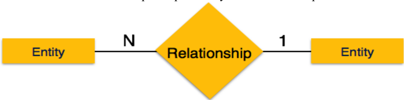

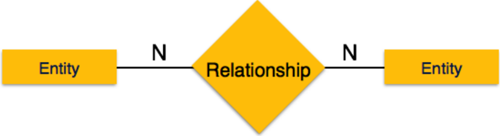

## Participation Constraints

-  Total Participation - Each entity is involved in the relationship. Total participation is represented by double lines.
-  Partial  participation -  Not  all  entities  are  involved  in  the  relationship.  Partial participation is represented by single lines.

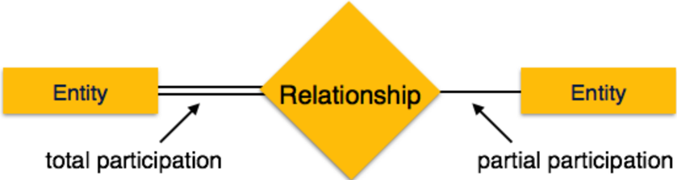

## Questions:-

1. Draw ER Diagram of Library Management system. Write relational schema of it
2. Draw ER diagram of College Management system. Write relational schema of it

## DBMS (DI04032011)

## DBMS (DI04032011)

## N. References / Suggestions

1. https://www.w3schools.com/sql/default.asp
2. https://www.tutorialspoint.com/dbms/
3. https://www.geeksforgeeks.org/dbms/

## O. Assessment-Rubrics

| Excellent  (18-20  Marks)                                                                                                | Good (13-17 Marks)                                                                                                                                   | Satisfactory  (7-12  Marks)                                                                                                   | Fair (0-6 Marks)                                                                                                          |
|--------------------------------------------------------------------------------------------------------------------------|------------------------------------------------------------------------------------------------------------------------------------------------------|-------------------------------------------------------------------------------------------------------------------------------|---------------------------------------------------------------------------------------------------------------------------|
|  Student  executes  the  queries  with  correct output.    Student submits  the lab report in  specified  time  limit. |  Student executes the  queries  having  correct  output  with  external guidance.    Student  submits  the  lab  report  in  specified time limit. |  Student executes  the  queries  with  incorrect output.    Student  submits  the  lab  report  in  specified  time  limit. |  Student is not able to  execute the queries.    Student  does  not  submit the lab report  in  specified  time  limit. |

## Sign with Date

Date: ……………

## Practical No.3:

Implement SQL queries to perform various DDL(Data Definition Language) Commands. (Create minimum 5 tables as per given definition with different data types and operate upon them).

1. Create a table named "users" with the following columns/ attributes: id (integer, primary key),name (varchar(50)),email (varchar(100))

## password (varchar(100))

2. Create a table named "products" with the following columns: id (integer, primary key),name (varchar(100)),price (decimal(10,2))

## description (text)

3. Create a table named "orders" with the following columns:
2. id  (integer,  primary  key),user\_id  (integer,  foreign  key  references  users(id)),product\_id (integer, foreign key references products(id))

## quantity (integer)

4. Create a table named " Students " with the following columns/ attributes: student\_id (integer, primary key), name (varchar(50)), age (integer), gender (varchar(10)), address (varchar(100))
5. Create a table named " Courses " with the following columns/ attributes: course\_id (integer, primary key), name (varchar(50)), credits (integer), instructor (varchar(50))
6. Create a table named " Enrollments " with the following columns/ attributes: enrollment\_id  (integer,  primary  key),  student\_id  (integer,  foreign  key  to  Students), course\_id (integer, foreign key to Courses), semester (varchar(20)), year (integer)
7. Create  a  table  named  "  Grades  "  with  the  following  columns/  attributes:  grade\_id (integer,  primary  key),  enrollment\_id  (integer,  foreign  key  to  Enrollments),  grade (varchar(2))

## A. Objective:

To perform various Data Definition Language (DDL) commands is to manage the structure of databases, tables, and indexes within a database management system (DBMS) using SQL commands

## B. Expected Program Outcomes (POs):

1. Basic and Discipline specific knowledge: Apply knowledge of basic mathematics, science and engineering fundamentals and engineering specialization to solve the Computer Engineering problems.
2. Problem analysis: Identify and analyse well-defined Computer Engineering problems using codified standard methods.
3. Design/development of solutions: Design solutions for Computer Engineering

well-defined technical problems and assist with the design of systems components or processes to meet specified needs.

4. Engineering Tools, Experimentation and Testing: Apply modern Computer Engineering tools and appropriate technique to conduct standard tests and measurements.
5. Life-long learning: Ability to analyse individual needs and engage in updating in the context of technological changes in field of engineering

## C. Expected Skills to be developed based on competency:

C ompilation, debugging, executing SQL queries related to DDL statements

## D. Expected Course Outcomes(Cos)

Perform queries on datasets using SQL*Plus

## E. Practical Outcome(PRo)

Write data definition queries , compilation, debugging, executing using oracle software

## F. Expected Affective domain Outcome (ADos)

-  Follow safety practices.
-  Practice good housekeeping.
-  Demonstrate working as a leader/a team member.
-  Maintain tools and equipment
-  Follow ethical practices.

## G. Prerequisite Theory:

##  SQL DATA TYPES:-

-  CHAR (size)
-  VARCHAR (size)/VARCHAR2 (size)
-  DATE
-  NUMBER (P, S)
-  LONG
-  RAW/LONGRAW

##  CHAR (SIZE)

-  This data type is used to store alphanumeric data of fixed length.
-  The size represents length of character to be stored.
-  This data type can store maximum 2000 characters.
-  This is faster to access but requires more storage.

##  VARCHAR (size)/VARCHAR2 (size)

-  This data type is used to store variable length alphanumeric data.
-  The maximum size of this data type is 4000 characters.
-  This is slower to access in comparison to CHAR but is efficient for storage.

##  DATE

-  This data type is used to store date and time.
-  The standard format is DD-MON-YY for example 21-JUN-09.
-  Date time stores time in the 24-hours format.
-  Range of this data type is January 1, 4712 B.C. to December 31, 4712A.D.

##  NUMBER (P,S)

-  The  NUMBER  data  type  is  used  store  numbers  (both  Integer  and  floating-point numbers).
-  We can store number up to 38 characters long.
-  The precision (P), determines the maximum length of number, and scale (s), determines the decimal point sign(.) on the right of  a number (P).

##  LONG

-  This data type is used to store variable length character strings upto 2GB.
-  LONG data can be used to store binary data in ASCII format.

##  RAW/LONG RAW

-  The  RAW/LONG RAW data type is used to store  binary  data,  such  as digitized picture or image.
-  RAW data type can have a maximum length of 255 bytes.
-  LONG RAW data type can contain upto 2GB.

##  DESCRIBE COMMAND

-  DESCRIBE or DESC (both are same) command to describe the structure of a table.
-  DESCRIBE or DESC command shows the structure of table which include name of the column, data-type of column and the nullability which means, that column can contain null values or not.
-  All of these features of table are described at the time of Creation of table.

## Syntax:

- SQL&gt; DESCRIBE TABLE NAME;
- OR
- SQL&gt; DESC TABLE NAME;

##  SQL DDL (DATA DEFINITION LANGUAGE) COMMANDS:-

-  CREATE
-  ALTER
-  RENAME
-  TRUNCATE
-  DROP

##  CREATE

-  Create command is used to create a table in database.

## Syntax:

SQL&gt; CREATE TABLE TABLE NAME ( COLUMNNAME\_1  DATATYPE(DATASIZE), COLUMNNAME\_2  DATATYPE(DATASIZE),

……….

COLUMNNAME\_NDATATYPE(DATASIZE) );

## Example:

SQL&gt;  CREATE  TABLE  CLIENT\_MASTER  (CLIENT\_NO  VARCHAR2(6),  NAME VARCHAR2(20),  CITY    VARCHAR2(15),  PINCODE  NUMBER(8),  STATE VARCHAR2(15));

## Show the Structure of a Table:

## Syntax:

SQL&gt; DESCRIBE CLIENT\_MASTER;

| NAME      | NULL?   | TYPE         |
|-----------|---------|--------------|
| CLIENT_NO |         | VARCHAR2(6)  |
| NAME      |         | VARCHAR2(20) |
| CITY      |         | VARCHAR2(15) |
| PINCODE   |         | NUMBER(8)    |
| STATE     |         | VARCHAR2(15) |

##  ALTER

-  ALTER command is used to ALTER (Modify structure of) a table in database.
-  ALTER command is used in five ways.
1. To add new column in table.
2. To modify data type or data size of existing column of table.
3. To drop (remove) the existing column of table.
4. To rename the name of existing table.
5. To rename the name of existing column of table.

## Syntax: (1 st  way- to add new column)

SQL&gt; ALTER TABLE TABLENAME ADD

(

NEW\_COLUMNNAME\_1   DATATYPE(DATASIZE),

NEW\_COLUMNNAME\_2   DATATYPE(DATASIZE),

……….

NEW\_COLUMNNAME\_NDATATYPE(DATASIZE)

);

## Example:

SQL&gt; ALTER  TABLE  CLIENT\_MASTER  ADD

(

MOBILE\_NO NUMBER(8), EMAIL CHAR(15)

);

Show the Structure of a Table: Syntax:

## SQL&gt; DESCRIBE CLIENT\_MASTER;

| NAME      | NULL?   | TYPE         |
|-----------|---------|--------------|
| CLIENT_NO |         | VARCHAR2(6)  |
| NAME      |         | VARCHAR2(20) |
| CITY      |         | VARCHAR2(15) |
| PINCODE   |         | NUMBER(8)    |
| STATE     |         | VARCHAR2(15) |
| MOBILE_NO |         | NUMBER(8)    |
| EMAIL     |         | CHAR(15)     |

## Syntax: (2 nd  way-modify data type or data size)

SQL&gt; ALTER TABLE TABLENAME

MODIFY

(

EXISTING\_COLUMNNAME\_1  NEW\_DATATYPE (NEW\_DATASIZE),

EXISTING\_COLUMNNAME\_2  NEW\_DATATYPE (NEW\_DATASIZE),

……….

EXISTING\_COLUMNNAME\_N  NEW\_DATATYPE(NEW\_DATASIZE)

## Example:

SQL&gt; ALTER  TABLE  CLIENT\_MASTER  MODIFY

( MOBILE\_NO NUMBER(10), EMAIL VARCHAR2(15));

## Show the Structure of a Table:

Syntax:

SQL&gt; DESCRIBE CLIENT\_MASTER;

NAME

NULL?

CLIENT\_NO

NAME

CITY

PINCODE

STATE

MOBILE\_NO

EMAIL

TYPE

VARCHAR2(6)

VARCHAR2(20)

VARCHAR2(15)

NUMBER(8)

VARCHAR2(15)

NUMBER(10)

VARCHAR2(15)

## Syntax: (3rd way-remove the column)

SQL&gt; ALTER TABLE  TABLENAME  DROP COLUMN COLUMNNAME;

## Example:

SQL&gt; ALTER  TABLE  CLIENT\_MASTER  DROP COLUMN MOBILE\_NO;

## Show the Structure of a Table:

Syntax:

SQL&gt; DESCRIBE CLIENT\_MASTER;

NAME

NULL?

CLIENT\_NO

NAME

CITY

PINCODE

STATE

);

TYPE

VARCHAR2(6)

VARCHAR2(20)

VARCHAR2(15)

NUMBER(8)

VARCHAR2(15)

## EMAIL

VARCHAR2(15)

Syntax: (4th way-rename table name)

SQL&gt; ALTER TABLE  OLD\_TABLENAME  RENAME TO NEW\_TABLENAME;

## Example:

SQL&gt; ALTER  TABLE  CLIENT\_MASTER  RENAME TO CLIENT\_MASTER\_COPY;

## Show the Structure of a Table:

Syntax:

SQL&gt; DESCRIBE CLIENT\_MASTER\_COPY;

| NAME      | NULL?   | TYPE         |
|-----------|---------|--------------|
| CLIENT_NO |         | VARCHAR2(6)  |
| NAME      |         | VARCHAR2(20) |
| CITY      |         | VARCHAR2(15) |
| PINCODE   |         | NUMBER(8)    |
| STATE     |         | VARCHAR2(15) |
| EMAIL     |         | VARCHAR2(15) |

## Syntax: (5th way-rename the column name)

SQL&gt; ALTER TABLE  TABLENAME RENAME COLUMN OLD\_COLUMNNAME TO NEW\_COLUMNNAME;

## Example:

SQL&gt; ALTER  TABLE  CLIENT\_MASTER  RENAME COLUMNEMAIL TO

## EMAIL\_ID;

## Show the Structure of a Table:

Syntax:

| SQL> DESCRIBE CLIENT_MASTER;   | SQL> DESCRIBE CLIENT_MASTER;   | SQL> DESCRIBE CLIENT_MASTER;   |
|--------------------------------|--------------------------------|--------------------------------|
| NAME                           | NULL?                          | TYPE                           |
| CLIENT_NO                      |                                | VARCHAR2(6)                    |
| NAME                           |                                | VARCHAR2(20)                   |
| CITY                           |                                | VARCHAR2(15)                   |
| PINCODE                        |                                | NUMBER(8)                      |
| STATE                          |                                | VARCHAR2(15)                   |
| EMAIL_ID                       |                                | VARCHAR2(15)                   |

##  RENAME

-  RENAME command is used to give new name of table.

## Syntax:

SQL&gt; RENAME OLD\_TABLENAME TO NEW\_TABLENAME;

## Example:

SQL&gt; RENAME CLIENT\_MASTER\_COPY  RENAME TO CLIENT\_MASTER;

##  TRUNCATE

-  TRUNCATE command is used to remove all records from a table, including all memory allocated for the records.

## Syntax:

SQL&gt; TRUNCATE  TABLE  TABLE NAME;

## Example:

SQL&gt;TRUNCATE TABLE  CLIENT\_MASTER;

##  DROP

-  DROP command is used to delete all records of a table along with its structure in database.

## Syntax:

SQL&gt; DROP  TABLE  TABLE NAME;

## Example:

SQL&gt;DROP TABLE  CLIENT\_MASTER;

## H. Resources/Equipment Required

Computer or laptop with a database management system (DBMS) software installed, such as  Oracle

- I. Safety and necessary Precautions followed

Shutdown computer system properly once the Lab hours are finished

- J. Source code / Solutions to queries:

## DBMS (DI04032011)

## DBMS (DI04032011)

## K. Practical related Quiz/Exercise.

1. The \_\_\_\_\_ command is used to completely remove a table from the database.
- A. INSERT ,
- B. ALTER
- C. DROP
- D. CREATE
6. The \_\_\_\_\_ command is used to modify columns in a table
- A. DROP
- B. INSERT
- C. ALTER
- D. CREATE
3. Pick the element which you must specify while creating a table
- A. Column name
- B. Column Data type
- C. Column size
- D. All of the above
4. Which of the following command is used to see the structure of a table
- A. UPDATE
- B. SHOW
- C. DESCRIBE
- D. SPOOL
5. What does NUMBER (8, 2) in oracle mean?
- A. It means there are 8 digits in total, 6 digits before the decimal and 2 after the decimal
- B. It means there are 10 digits in total with 8 digits before the decimal and 2 after decimal
- C. It means there are 2 digits before the decimal and 8 after the decimal point
- D. None of the above.

## L. References / Suggestions ( lab manual designer should give)

https://www.geeksforgeeks.org/ddl-commands-syntax/ https://www.w3schools.com/sql/ https://www.tutorialspoint.com/sql/index.htm

- 2.

## M. Assessment-Rubrics

| Excellent  (18-20  Marks)                                                                                                  | Good (13-17 Marks)                                                                                                                                 | Satisfactory  (7-12  Marks)                                                                                                 | Fair (0-6 Marks)                                                                                                                |
|----------------------------------------------------------------------------------------------------------------------------|----------------------------------------------------------------------------------------------------------------------------------------------------|-----------------------------------------------------------------------------------------------------------------------------|---------------------------------------------------------------------------------------------------------------------------------|
|  Student  executes  the  queries  with  correct output.    Student  submits the lab  report  in  specified  time  limit. |  Student executes the  queries  having  correct  output  with  external guidance.    Student submits the  lab  report  in  specified time limit. |  Student  executes  the  queries  with  incorrect output.    Student  submits  the lab report in  specified  time  limit. |  Student  is  not  able  to  execute  the  queries.    Student  does  not  submit the lab report  in  specified  time  limit. |

Sign with Date

## Practical No.4:

Implement SQL queries to perform various DML Commands.

## Note :

-  You can use tables created in PRACTICAL 3 or default tables available in HR schema to perform any DML commands
-  You can list available default tables in HR Schema using below Query

SELECT OWNER, TABLE\_NAME FROM DBA\_TABLES WHERE OWNER='HR';

## HR Table Descriptions

## Table COUNTRIES

| Name                                                                                                                         | Null?    Type   |
|------------------------------------------------------------------------------------------------------------------------------|-----------------|
| COUNTRY_ID                                NOT    COUNTRY_NAME                                       VARCHAR2(40)   REGION_ID | NULL CHAR(2)    |
|                                                                                                                              | NUMBER          |

## Table DEPARTMENTS

| Name                                                        | Null?   | Type                    |
|-------------------------------------------------------------|---------|-------------------------|
| DEPARTMENT_ID                             NOT NULL          |         | NUMBER(4)               |
| DEPARTMENT_NAME                      NOT NULL    MANAGER_ID |         | VARCHAR2(30)  NUMBER(6) |
| LOCATION_ID                                                 |         | NUMBER(4)               |

## Table EMPLOYEES

| Name                                                                                                                                                                                                                                                                                                                                                                                                                                                                                                                                    | Null?   | Type                                                                                                                                                                                                                                           |
|-----------------------------------------------------------------------------------------------------------------------------------------------------------------------------------------------------------------------------------------------------------------------------------------------------------------------------------------------------------------------------------------------------------------------------------------------------------------------------------------------------------------------------------------|---------|------------------------------------------------------------------------------------------------------------------------------------------------------------------------------------------------------------------------------------------------|
| EMPLOYEE_ID                               NOT NULL   FIRST_NAME                                            LAST_NAME                                    EMAIL                                 PHONE_NUMBER                                       HIRE_DATE                                     NOT NULL    JOB_ID                                             NOT NULL   SALARY                                                COMMISSION_PCT                             MANAGER_ID                                      DEPARTMENT_ID |         | ----------------------------------------- --------  --------------------------------   NUMBER(6)  VARCHAR2(20)  NOT NULL VARCHAR2(25)  NOT NULL VARCHAR2(25)  VARCHAR2(20)  DATE  VARCHAR2(10)  NUMBER(8,2)  NUMBER(2,2)  NUMBER(6)  NUMBER(4) |

## Table JOBS

| Name                                   Null?       | Type         |
|----------------------------------------------------|--------------|
| JOB_ID                                    NOT NULL | VARCHAR2(10) |
| JOB_TITLE                             NOT NULL     | VARCHAR2(35) |
| MIN_SALARY                                         | NUMBER(6)    |
| MAX_SALARY                                         | NUMBER(6)    |

Date: ……………

## Table JOB\_HISTORY

| Name                                      Null?    | Type         |
|----------------------------------------------------|--------------|
| EMPLOYEE_ID                      NOT NULL          | NUMBER(6)    |
| START_DATE                         NOT NULL        | DATE         |
| END_DATE                             NOT NULL      | DATE         |
| JOB_ID                                    NOT NULL | VARCHAR2(10) |
| DEPARTMENT_ID                                      | NUMBER(4)    |

## Table LOCATIONS

| Name                                        Null?                                                                                                                                                                                                                            | Type                                                                        |
|------------------------------------------------------------------------------------------------------------------------------------------------------------------------------------------------------------------------------------------------------------------------------|-----------------------------------------------------------------------------|
| LOCATION_ID                     NOT NULL   STREET_ADDRESS                                        POSTAL_CODE                                           CITY                                      NOT NULL   STATE_PROVINCE                                        COUNTRY_ID | NUMBER(4)  VARCHAR2(40)  VARCHAR2(12)   VARCHAR2(30)  VARCHAR2(25)  CHAR(2) |

## Table REGIONS

| Name                                      Null?                          Type   |
|---------------------------------------------------------------------------------|
| REGION_ID                                 NOT NULL         NUMBER               |
| REGION_NAME                                                      VARCHAR2(25)   |

## A. Objective:

To perform various Data Manipulation Language (DML) commands is to enable users to interact with a database and modify its contents in a structured and controlled manner.

## B. Expected Program Outcomes (POs):

1. Basic and Discipline specific knowledge: Apply knowledge of basic mathematics, science and engineering fundamentals and engineering specialization to solve the Computer Engineering problems.
2. Problem analysis: Identify and analyse well-defined Computer Engineering problems using codified standard methods.
3. Design/development of solutions: Design solutions for Computer Engineering well-defined technical problems and assist with the design of systems components or processes to meet specified needs.
4. Engineering Tools, Experimentation and Testing: Apply modern Computer Engineering tools and appropriate technique to conduct standard tests and measurements.

5. Life-long learning: Ability to analyse individual needs and engage in updating in the context of technological changes in field of engineering.

## C. Expected Skills to be developed based on competency:

C ompilation, debugging, executing SQL queries

## D. Expected Course Outcomes(Cos)

E.

Perform queries on datasets using SQL*Plus

## E. Practical Outcome(PRo)

Write data definition queries , compilation, debugging, executing using oracle software

## F. Expected Affective domain Outcome (ADos)

-  Follow safety practices.
-  Practice good housekeeping.
-  Demonstrate working as a leader/a team member.
-  Maintain tools and equipment
-  Follow ethical practices.

## G. Prerequisite Theory:

##  SQL DML (DATA MANIPLUATION LANGUAGE) COMMANDS:-

 INSERT

 UPDATE

 DELETE

##  INSERT

-  Insert command is Used to insert data into a table or create a new row in table:
-  We have two methods to insert data in a table
1. By value method
2. By address method

## Syntax: (1 st  way-BY value method)

## 1 st  Way

SQL&gt;INSERT  INTO  TABLENAME  VALUES  (VALUE\_1,VALUE\_2,  VALUE\_3  …. VALUE\_N);

OR

## 2 nd  Way

SQL&gt; INSERT INTO  TABLENAME  (COLUMN\_1,  COLUMN\_2,  COLUMN\_3 ………COLUMN\_N) VALUES (VALUE\_1, VALUE\_2, VALUE\_3 …. VALUE\_N);

## Example:

## 1 st  Way

SQL&gt; INSERT INTO CLIENT\_MASTER VALUES ('C00001', 'RAHUL', 'MUMBAI', 400054,' MAHARASHTRA');

OR

## 2 nd  Way

SQL&gt;INSERT INTO CLIENT\_MASTER (CLIENT\_NO, NAME,CITY, PINCODE, [INSERT MORE VALUE]

STATE) VALUES ('C00001', 'RAHUL', 'MUMBAI', 400054, 'MAHARASHTRA'); 'MANISH',

SQL&gt;INSERT INTO CLIENT\_MASTER VALUES ('C00002', 'BANGALORE',560001, 'KARNATAKA');

To insert a new record again you have to type entire insert command, if there are lot of records this will be difficult. This will be avoided by using address method.

## Show the Records of a Table:

## Syntax:

SQL&gt; select * from  client\_master;

Client\_no

|        | Name   | City      |   Pincode | State       |
|--------|--------|-----------|-----------|-------------|
| C00001 | RAHUL  | Mumbai    |    400054 | Maharashtra |
| C00002 | MANISH | Bangalore |    560001 | Karnataka   |

## Syntax: (2 nd  way-BY address method)

SQL&gt;INSERT INTO TABLENAME VALUES (&amp;COLUMN\_1, &amp;COLUMN\_2,…. &amp; COLUMN\_N);

## OR

SQL&gt; INSERT INTO TABLENAME(COLUMN\_1, COLUMN\_2, COLUMN\_3 ………COLUMN\_N) VALUES (&amp;COLUMN\_1, &amp;COLUMN\_2, &amp;COLUMN\_3 …. &amp;COLUMN\_N);

This will prompt you for the values but for every insert you have to use forward slash .

## Example:

SQL&gt; INSERT INTO CLIENT\_MASTER VALUES ('&amp;CLIENT\_NO', '&amp;NAME', '&amp;CITY', &amp;PINCODE, '&amp;STATE ');

Enter value for client\_no: C0001

Enter value for name: Rahul

Enter value for city: Mumbai

Enter value for pincode: 400054

Enter value for state: Maharashtra

## SQL&gt;

Enter value for client\_no: C0002

Enter value for name: Manish

Enter value for city: Bangalore

Enter value for pincode: 560001

Enter value for state: Karnataka

## Show the Records of a Table:

Syntax:

SQL&gt; SELECT * FROM CLIENT\_MASTER;

CLIENT\_NO

|        | NAME                  | CITY         PINCODE   | STATE                                            |
|--------|-----------------------|------------------------|--------------------------------------------------|
| C00001 | RAHUL          MUMBAI | 400054                 | MAHARASHTRA                                      |
| C00002 | MANISH                |                        | BANGALO    560001                      KARNATAKA |

##  UPDATE

-  The UPDATE command is used to change or modify data of a table
-  The Update command is used to update selected rows from table or all the rows from table

## Syntax:(update selected rows)

SQL&gt; UPDATE TABLENAME SET COLUMNNAME\_1 = EXPRESSION\_1, COLUMNNAME\_2 = EXPRESSION\_2 WHERE CONDITION;

## Example:

SQL&gt;UPDATE CLIENT\_MASTER SET CITY='BOMBAY' WHERE CLIENT\_NO='C00002';

## Show the Records of a Table:

## Syntax:

SQL&gt; SELECT * FROM CLIENT\_MASTER;

| CLIENT_NO   | NAME   | CITY   |   PINCODE | STATE       |
|-------------|--------|--------|-----------|-------------|
| C00001      | RAHUL  | MUMBAI |    400054 | MAHARASHTRA |
| C00002      | MANISH | BOMBAY |    560001 | KARNATAKA   |

## Syntax:(update all rows)

SQL&gt;UPDATE TABLENAME SET COLUMNNAME\_1 = EXPRESSION\_1;

## Example:

SQL&gt;UPDATE CLIENT\_MASTER SET NAME = 'OHM';

## Show the Records of a Table:

## Syntax:

SQL&gt; SELECT * FROM CLIENT\_MASTER;

| CLIENT_NO   | NAME   CITY       |   PINCODE | STATE       |
|-------------|-------------------|-----------|-------------|
| C00001      | OHM        MUMBAI |    400054 | MAHARASHTRA |
| C00002      | OHM        BOMBAY |    560001 | KARNATAKA   |

##  DELETE

-  The DELETE command is used to delete data  or rows from a table
-  The  delete command is used to delete selected rows from table or All the rows from table

## Syntax: (delete selected rows)

SQL&gt; DELETE FROM TABLENAME WHERE CONDITION;

## Example:

SQL&gt; DELETE FROM CLIENT\_MASTER WHERE CLIENT\_NO='C00001';

## Show the Records of a Table:

## Syntax:

SQL&gt; SELECT * FROM CLIENT\_MASTER;

| CLIENT_NO   | NAME   | CITY   |   PINCODE | STATE     |
|-------------|--------|--------|-----------|-----------|
| C00002      | OHM    | BOMBAY |    560001 | KARNATAKA |

## Syntax: (delete all rows)

SQL&gt; DELETE FROM TABLE NAME;

## Example:

SQL&gt; DELETE FROM CLIENT\_MASTER;

## Show the Records of a Table:

Syntax:

SQL&gt; SELECT * FROM CLIENT\_MASTER;

SQL&gt;No Rows selected

##  SELECT

 The SELECT command is used to retrieve selected rows from one or more tables.

Syntax: (retrieve all table data )

SQL&gt;SELECT * FROM  TABLE\_NAME;

Example:

SQL&gt; SELECT * FROM CLIENT\_MASTER;

Syntax: (retrieve particular columns of a table )

SQL&gt;SELECT COLUMNNAME\_1, COLUMNNAME\_2  FROM  TABLE\_NAME;

SQL&gt; SELECT NAME, CITY FROM CLIENT\_MASTER;

Syntax: (retrieve particular column of particular row of a table )

SQL&gt; SELECT COLUMNNAME\_N  FROM   TABLE\_NAME  WHERE  CONDITION;

SQL&gt;SELECT  NAME  FROM CLIENT\_MASTER WHERE CITY='BOMBAY';

Syntax: (retrieve particular rows of a table )

SQL&gt; SELECT * FROM   TABLE\_NAME  WHERE  CONDITION;

SQL&gt;SELECT * FROM CLIENT\_MASTER WHERE CITY='BOMBAY';

##  SQL Operators

-  Arithmetic Operators
-  Oracle allows arithmetic operators to use while viewing records from table or while performing data manipulation operations such as Insert, Update and Delete.
-  These are:

+   Addition                             * Multiplication

- ** Exponentiation                  () Enclosed operation

-    Subtraction                         / Division

## Example:

SQL&gt;Select product\_no, description, sell\_price * 0.05 from product\_master;

##  Logical Operators

-  The AND Operator
-  The OR Operator
-  The NOT Operator

##  The AND Operator

-  The AND Operator allows creating an SQL statement based on two or more conditions being met.
-  It can be used in any valid SQL statement such as select, insert, or delete.

## Example:

SQL&gt;SELECT    PRODUCT\_NO,    DESCRIPTION,    SELL\_PRICE    *    0.05    FROM PRODUCT\_MASTER WHERE SELL\_PRICE BETWEEN 500 AND 1100;

##  The OR Operator

-  The  OR  condition  allows  creating  an  SQL  statement  where  records  are returned when any one of the conditions are met
-  It can be used in any valid SQL statement such as select, insert, or delete.

## Example:

SQL&gt;SELECT CLIENT\_NO, NAME, CITY, PINCODE FROM CLIENT\_MASTER WHERE PINCODE=4000054 OR PINCODE=4000057;

##  The NOT Operator

-  The Oracle engine will process all rows in a table and display only those Records that do not satisfy the condition specified Example:

SQL&gt;SELECT * FROM CLIENT\_MASTER  WHERE NOT (  CITY='BOMBAY' OR CITY='DELHI');

##  Comparison Operators

-  Comparison operators are used in condition to compare one expression with other.
-  The comparison operators are =, &lt;, &gt;, &gt;=, &lt;=, !=, between, like, is null and in operators

##  Between operator

-  Between operator is used to check between two values or specific range Example:

SQL&gt;SELECT * FROM SALESMAN\_MASTER WHERE SALARY BETWEEN 5000 AND 8000;

The above select statement will display only those rows where salary of salesman is between 5000 and 8000.

##  In operator:

-  The IN operator can be used to select rows that match one of the values in a list. SQL&gt; SELECT * FROM CLIENT\_MASTER WHERE CLIENT\_NO IN(C00001, C00003);

The above query will retrieve only those rows where client\_no is either in C00001 or C00003

##  Like operator:

-  The Like operator is used to search character pattern.
-  The like operator is used with special character % and \_(underscore)
- SQL&gt; SELECT * FROM CLIENT\_MASTER WHERE CITY LIKE ' B% ';
- The above select statement will display only those rows where city is start with 'b' followed by any number of any characters.
- % sign is used to refer number of character ( it similar to * asterisk wildcard in DOS). While \_(underscore) is used to refer single character.
- SQL&gt; SELECT * FROM CLIENT\_MASTER WHERE NAME LIKE '\_AHUL';

## H. Resources/Equipment Required

Computer or laptop with a database management system (DBMS) software installed, such

- as  Oracle

## I. Safety and necessary Precautions followed

Shutdown computer system properly once the Lab hours are finished

- J. Source code / Solutions to queries:

## DBMS (DI04032011)

## K. Practical related Quiz.

1. Which of the following is true about inserting news rows to a table?
2. A - You must list values in the default order of the columns in the table.
3. B - You can also list the columns in the INSERT clause.
4. C - You can use the INSERT statement to add rows from one table to another.
5. D - All of the above.
2. Which of the following code will successfully delete the table LOCATIONS from the database?
7. A - DROP TABLE locations;
8. B - DELETE TABLE locations;
9. C - TRUNCATE TABLE locations;
10. D - None of the above.
3. Which operator is used to compare a value to a specified list of values?
- A. ANY
- B. BETWEEN
- C. ALL
- D. IN
4. What operator tests column for absence of data
- A. NOT Operator
- B. Exists Operator
- C. IS NULL Operator
- D. None of the above
5. In which of the following cases a DML statement is not executed?
- A. When existing rows are modified.
- B. When a table is deleted.
- C. When some rows are deleted.
- D. All of the above

## L. References / Suggestions ( lab manual designer should give)

https://www.geeksforgeeks.org/ddl-commands-syntax/ https://www.w3schools.com/sql/

https://www.tutorialspoint.com/sql/index.htm

## Assessment-Rubrics

| Excellent  (18-20  Marks)                                                                                                | Good (13-17 Marks)                                                                                                                                   | Satisfactory  (7-12  Marks)                                                                                                   | Fair (0-6 Marks)                                                                                                          |
|--------------------------------------------------------------------------------------------------------------------------|------------------------------------------------------------------------------------------------------------------------------------------------------|-------------------------------------------------------------------------------------------------------------------------------|---------------------------------------------------------------------------------------------------------------------------|
|  Student  executes  the  queries  with  correct output.    Student submits  the lab report in  specified  time  limit. |  Student executes the  queries  having  correct  output  with  external guidance.    Student  submits  the  lab  report  in  specified time limit. |  Student executes  the  queries  with  incorrect output.    Student  submits  the  lab  report  in  specified  time  limit. |  Student is not able to  execute the queries.    Student  does  not  submit the lab report  in  specified  time  limit. |

## Sign with Date

Date: ……………

## Practical No. 5:

## Implement SQL queries using Date functions like add-months, months-between, round, nextday, truncate etc.

Write down the queries using date function:-

1. Find a date after adding 4 months to '01-06-19'.
2. Find a total months between '01-01-19' to '01-05019'.
3. Find a last date of '01-02-'19'.
4. Find out date of next Tuesday after '18-06-19'.
5. Find the round format date for '17-06-19 12:35pm', '17-06-19 12:35am' and '17-0619 01:30pm'.
6. Find the trunc format date for '17-06-19 12:35pm', '17-06-19 12:35am' and '1706-19 01:30pm'.
7. Find out the date of next Sunday after today.

## A. Objective:

SQL provides various date functions to perform common operations on date and time values, such as extracting date and time components, calculating differences between dates, and formatting dates in different ways

## B. Expected Program Outcomes (POs):

1. Basic and Discipline specific knowledge: Apply knowledge of basic mathematics, science and engineering fundamentals and engineering specialization to solve the Computer Engineering problems.
2. Problem analysis: Identify and analyse well-defined Computer Engineering problems using codified standard methods.
3. Design/development of solutions: Design solutions for Computer Engineering well-defined technical problems and assist with the design of systems components or processes to meet specified needs.
4. Engineering Tools, Experimentation and Testing: Apply modern Computer Engineering tools and appropriate technique to conduct standard tests and measurements.
5. Life-long learning: Ability to analyse individual needs and engage in updating in the context of technological changes in field of engineering.

## C. Expected Skills to be developed based on competency:

C ompilation, debugging, executing SQL queries

## D. Expected Course Outcomes(Cos)

Perform joins, sub-queries and nested queries on multiple tables using SQL*plus

## E. Practical Outcome(PRo)

Write data definition queries , compilation, debugging, executing using SQL

## F. Expected Affective domain Outcome (ADos)

-  Follow safety practices.
-  Practice good housekeeping.
-  Demonstrate working as a leader/a team member.
-  Maintain tools and equipment
-  Follow ethical practices.

## G. Prerequisite Theory:

##  SQL DATE FUNCTIONS:-

 ADD\_MONTHS

 MONTHS\_BETWEEN

 LAST\_DAY

 NEXT\_DAY

 ROUND

 TRUNC

NOTE:- CONSIDER '31-DEC-2012' AS A SYSDATE.

##  ADD\_MONTHS

-  ADD\_MONTHS function  returns  new  date  after  adding  the  number  of  months specified in the function.

## Syntax:

SQL&gt; ADD\_MONTHS (D, N);

## Example:

SQL&gt; SELECT ADD\_MONTHS (SYSDATE,3) 'ADD MONTHS' FROM DUAL;

SQL&gt;ADD MONTHS

31-MAR-13

-  IF n IS NEGATIVE, Then n MONTH will be subtracted.

SQL&gt; SELECT ADD\_MONTHS (SYSDATE,-3) 'ADD MONTHS' FROM DUAL;

SQL&gt;ADD MONTHS

30-SEP-12

##  MONTHS\_BETWEEN

-  MONTHS\_BETWEEN  function  returns  number  of  months  between  date1  and date2.

## Syntax:

SQL&gt;MONTHS\_BETWEEN (DATE1, DATE2);

## Example:

SQL&gt;SELECT MONTHS\_BETWEEN ('31-MAR-13','31-DEC-12') 'MONTHS BETWEEN' FROM DUAL; SQL&gt;MONTHS BETWEEN

3

##  LAST\_DAY

-  LAST\_DAY function returns the last date of the month specified with the function.

## Syntax:

SQL&gt;LAST\_DAY (DATE);

## Example:

SQL&gt;SELECT LAST\_DAY ('1-MAR-13') 'LASTDAY' FROM DUAL;

SQL&gt;LASTDAY

31-MAR-13

##  NEXT\_DAY

-  NEXT\_DAY function returns the date of the next named weekday specified by day relative to date.

## Syntax:

SQL&gt;NEXT\_DAY (DATE, DAY);

## Example:

SQL&gt; SELECT NEXT\_DAY ('3-JUNE-19','SUNDAY') 'NEXTDAY' FROM DUAL;

SQL&gt; NEXTDAY

09-JUNE-19

##  ROUND

-  ROUND function returns the rounded date according to format.
-  A format can be any valid format.
-  If  format is omitted, date is rounded to the next day if time is 12.00 pm or later otherwise return today's date.

## Syntax:

SQL&gt;ROUND (DATE, FORMAT);

## Example:

SQL&gt;SELECT ROUND(TO\_DATE('31-DEC-12 03:30:45 PM','DD-MM-YY HH:MI:SS

PM')) FROM DUAL; SQL&gt;ROUND(TO\_

---------

01-JAN-13

SQL&gt; SELECT ROUND(TO\_DATE('31-DEC-12 12:00:00 PM','DD-MM-YY HH:MI:SS PM')) FROM DUAL;

SQL&gt;ROUND(TO\_

---------

01-JAN-13

SQL&gt; SELECT ROUND(TO\_DATE('31-DEC-12 03:30:45 AM','DD-MM-YY HH:MI:SS PM')) FROM DUAL;

SQL&gt;ROUND(TO\_

---------

31-DEC-12

##  TRUNC

-  TRUNC function returns the truncated date according to format.
-  A format can be any valid format.
-  If format is omitted, date is truncated to 12.00 am.

## Syntax:

SQL&gt;TRUNC (DATE, FORMAT);

Example:

SQL&gt;SELECT TRUNC(TO\_DATE('31-DEC-12 03:30:45 PM','DD-MM-YY HH:MI:SS PM')) FROM DUAL; SQL&gt;TRUNC(TO\_

---------

31-DEC-12 PM')) FROM DUAL; SQL&gt;TRUNC(TO\_

SQL&gt; SELECT TRUNC(TO\_DATE('31-DEC-12 12:00:00 PM','DD-MM-YY HH:MI:SS

---------

31-DEC-12

SQL&gt; SELECT TRUNC(TO\_DATE('31-DEC-12 03:30:45 AM','DD-MM-YY HH:MI:SS PM')) FROM DUAL; SQL&gt;TRUNC(TO\_

---------

31-DEC-12

## H. Resources/Equipment Required

Computer or laptop with a database management system (DBMS) software installed, such as Oracle

## I. Safety and necessary Precautions followed

Shutdown computer system properly once the Lab hours are finished

- J. Source code / Solutions to queries:

DBMS (DI04032011)

## K. Practical related Quiz

1. Result of the below two queries will be:

SELECT DATEDIFF(week,'2005-12-31 23:59:59.9999999','2006-01-01 00:00:00.0000000');

SELECT DATEDIFF(hour,'2005-12-31 23:59:59.9999999','2006-01-01 00:00:00.0000000');

- A    24, 1
- B    1, 24
- C    1, 1
- D    None of the above
2. Result of the below query will be:

SET DATEFORMAT mdy;

SELECT ISDATE('12/31/208');

- A  0
- B  1
- C  2
- D  3.
3. When you convert to date and time data types, SQL rejects all values it cannot recognize as dates or times.
- A  True
- B  False
4. If result of below query :
- select CONVERT(VARCHAR(19),GETDATE())
- is: Jul 29 2014 9:46AM
- what will be the result of below query:select
- CONVERT(VARCHAR(10),GETDATE(),10)
5. Which of the following function checks whether the expression is a valid date or not?
- A   ISDATE
- B   ISDAY
- C   ISVALID
- D   ISYEAR

- A  Jul 29 2014

- B  07-29-14 9:46AM

- C  07-29-14

- D  Jul 29 201

## L. References / Suggestions

## https://www.geeksforgeeks.org/ddl-commands-syntax/

## https://www.w3schools.com/sql/

## https://www.tutorialspoint.com/sql/index.htm

## M. Assessment-Rubrics

| Excellent  (18-20  Marks)                                                                                                | Good (13-17 Marks)                                                                                                                                   | Satisfactory  (7-12  Marks)                                                                                                   | Fair (0-6 Marks)                                                                                                          |
|--------------------------------------------------------------------------------------------------------------------------|------------------------------------------------------------------------------------------------------------------------------------------------------|-------------------------------------------------------------------------------------------------------------------------------|---------------------------------------------------------------------------------------------------------------------------|
|  Student  executes  the  queries  with  correct output.    Student submits  the lab report in  specified  time  limit. |  Student executes the  queries  having  correct  output  with  external guidance.    Student  submits  the  lab  report  in  specified time limit. |  Student executes  the  queries  with  incorrect output.    Student  submits  the  lab  report  in  specified  time  limit. |  Student is not able to  execute the queries.    Student  does  not  submit the lab report  in  specified  time  limit. |

## Sign with Date

Date: ……………

## Practical No .6:

Implement SQL queries using Numeric functions like abs, ceil, power, mod, round, trunc, sqrt etc. and Character Functions like initcap, lower, upper, ltrim, rtrim, replace, substring, instr etc..

## Write down the queries using numeric function:-

1. Find the absolute value of -15.
2. Find the square root of 81.
3. Find the value for 3 raised to power 4.
4. Find the remainder for 16 divided by 5.
5. Find the largest integer value which is greater than or equal to -27.2.
6. Find the smallest integer value which is less than or equal to -24.2.
7. Find the value for 182.284 which is rounded to -2.
8. Find the value for 182.284 which is rounded to 1.
9. Find the value for 182.284 which is truncated to -2.
10. Find the value for 182.284 which is truncated to 1.
11. Find the value for e which is raised to power 4.

## Write down the queries using character function:-

Note : Consider Employees table from HR schema to solve queries.

1. Count number of characters in a string 'Computer Engineering'.
2. Count number of characters in each employee's name.
3. Convert string 'COMPUTER' in lowercase.
4. Display  fisrt name of all employees in lowercase.
5. Display last name of all employees in uppercase.
6. Convert string 'oracle10g' in uppercase.
7. Display first letter of each word in a string 'character function' in uppercase.
8. Extract 11 characters from the string 'Computer Engineering', starting from 12 th character.
9. Extract first 3 characters from employee's first name.
10. Display last name of all employees' right justified with total length of 20 characters, fill up the blank characters with '#'.
11. Display last name of all employees left justified with total length 15 characters, fill up the blank characters with '*'.
12. Remove characters 'gbrsea' from string 'greatest' from left side.
13. Change character 'ornt' by 'xynt' from the string 'government'.
14. Change the word 'govern' by 'suppli' in a string 'government'.
15. Display ascii values of 's' ,'A' and 'a'.
16. Find the first occurrence of base in string 'Database'.

## A. Objective:

Numeric functions are used to perform mathematical operations, while character functions are used to manipulate and perform operations on character data

## B. Expected Program Outcomes (POs):

1. Basic and Discipline specific knowledge: Apply knowledge of basic mathematics, science and engineering fundamentals and engineering specialization to solve the Computer Engineering problems.
2. Problem analysis: Identify and analyse well-defined Computer Engineering problems using codified standard methods.
3. Design/development of solutions: Design solutions for Computer Engineering well-defined technical problems and assist with the design of systems components or processes to meet specified needs.
4. Engineering Tools, Experimentation and Testing: Apply modern Computer Engineering tools and appropriate technique to conduct standard tests and measurements.
5. Life-long learning: Ability to analyse individual needs and engage in updating in the context of technological changes in field of engineering.

## C. Expected Skills to be developed based on competency:

C ompilation, debugging, executing SQL queries

## D. Expected Course Outcomes(Cos)

Perform joins, sub-queries and nested queries on multiple tables using SQL*plus.

## E. Practical Outcome(PRo)

Write data definition queries , compilation, debugging, executing using SQL

## F. Expected Affective domain Outcome (ADos)

-  Follow safety practices.
-  Practice good housekeeping.
-  Demonstrate working as a leader/a team member.
-  Maintain tools and equipment
-  Follow ethical practices.

## G. Prerequisite Theory:

##  SQL NUMERIC FUNCTIONS:-

- 1) ABS 2) CEIL

3) EXP

4)FLOOR

- 7) ROUND 8) TRUNC 9) SQRT

##  ABS()

-  ABS() function returns absolute value.

5) POWER

6) MOD

Syntax: ABS (N);

## Example:

SQL&gt; SELECT ABS (3), ABS(-3) 'ABSOLUTEVALUE' FROM DUAL; ABSOLUTEVALUE ABSOLUTEVALUE

<!-- formula-not-decoded -->

##  CEIL( )

-  CEIL() function returns the smallest integer that is greater than or equal to a specific value.

Syntax: CEIL (N);

## Example:

SQL&gt; SELECT CEIL(-25.4)"CEIL1",CEIL(25.4)"CEIL2" FROM DUAL;

CEIL1      CEIL2

---------- ----------

-25            26

##  EXP()

-  EXP() function returns e raised to the nth power, where e=2.71828183.

Syntax: EXP (N);

## Example:

SQL&gt; SELECT EXP ('1') 'EXP' FROM DUAL;

SQL&gt; EXP

2.71828183

##  FLOOR()

-  FLOOR() function returns the greatest integer that is less than or equal to a specific value.

Syntax: FLOOR (N);

## Example:

SQL&gt;SELECT FLOOR ('25.4') "FLOOR" ,FLOOR ('25.5') "FLOOR",FLOOR ('25.5')

"FLOOR" FROM DUAL;

SQL&gt;FLOOR      FLOOR      FLOOR

25 25         25

SQL&gt; SELECT FLOOR ('-25.4') "FLOOR" ,FLOOR ('-25.5') "FLOOR",FLOOR ('-25.5')

"FLOOR" FROM DUAL;

SQL&gt; FLOOR      FLOOR      FLOOR

- 26         -26        -26

##  POWER()

-  POWER() function returns the value raised to a given positive exponent.

Syntax: POWER(VALUE,EXPONENT);

## Example:

SQL&gt; SELECT POWER (3,2) 'POWER' FROM DUAL;

SQL&gt; POWER

9

##  MOD()

-  MOD() function divides a value by a divisor and returns the remainder.

Syntax: MOD(VALUE,DIVISER);

## Example:

SQL&gt; SELECT MOD (9,2) 'REMAINDER' FROM DUAL;

## SQL&gt; REMAINDER

1

##  ROUND()

-  ROUND() function rounds a number to given number of digits of precision.

Syntax: ROUND(VALUE,PRECISION);

## Example:

SQL&gt;SELECT ROUND (255.555,1) "ROUND",ROUND (255.555,2) "ROUND",ROUND (255.555,3) "ROUND" FROM DUAL;

SQL&gt;ROUND ROUND ROUND

255.6 255.56      255.555

##  TRUNC()

-  TRUNC() function truncates digits of precision from a number.

Syntax: TRUNC(VALUE,PRECISION);

## Example:

SQL&gt;SELECT TRUNC (255.555,1) "TRUNC",TRUNC (255.555,2) "TRUNC",TRUNC (255.555,3) "TRUNC" FROM DUAL;

SQL&gt;TRUNC TRUNC TRUNC

255.5 255.55      255.555

##  SQRT()

-  SQRT() function returns the square root of a given number.

Syntax: SQRT(N);

## Example:

SQL&gt; SELECT SQRT (9) 'SQRT' FROM DUAL;

SQL&gt; SQRT

3

##  SQL CHARACTER FUNCTIONS:-

1) INITCAP

2) LOWER

3) UPPER

4)LTRIM

5) RTRIM

6) TRANSLATE

7) REPLACE

8) SUBSTRING

9) LENGTH

10) LPAD

12) RPAD

13) ASCII

##  INITCAP()

-  INITCAP() function converts any string or (column of table)with the first character of each word in UPPER CASE.

Syntax: INITCAP(STRING);

## Example:

SQL&gt; select initcap('database management system') '1stcharacterinuppercase' from dual;

## SQL&gt;1stcharacterinuppercase

Database Management System

##  LOWER()

-  LOWER() function converts any string or (column of table)into lowercase.

## Syntax: lower(string);

## Example:

SQL&gt; select lower ('DATABASE') 'lower' from dual;

SQL&gt;lower database

##  UPPER()

-  UPPER() function converts any string or (column of table)into uppercase.

converts any string or (column of table) into uppercase.

Syntax: upper(string);

## Example:

SQL&gt; select upper ('database') 'upper' from dual;

SQL&gt;upper

## DATABASE

##  LTRIM()

-  LTRIM() function returns a string with all characters contained in the set are removed from the left end of the string.

## Syntax:

SQL&gt;ltrim(,set);

## Example: char

SQL&gt; select ltrim('000123', '0')"ltrim1",ltrim('123123Tech', '123')    'ltrim2' from dual;

SQL&gt;ltrim1ltrim2

123       Tech

##  RTRIM()

-  RTRIM() function returns a string with all characters contained in the set are removed from the right end of the string.

## Syntax:

SQL&gt;rtrim(char,set);

## Example:

SQL&gt; select rtrim('123000', '0')"rtrim1",rtrim('Tech123123', '123')

'rtrim2' from dual;

SQL&gt; rtrim1rtrim2

123       Tech

##  TRANSLATE()

-  TRANSLATE ( ) function Replace a sequence of character in a string with another set of characters.

Syntax: TRANSLATE(string1,string to replace, replacement string);

## Example:

SQL&gt; SELECT TRANSLATE ('COMPUTER','COMPU',HEA') 'TRANSLATESTRING' FROM DUAL;

## SQL&gt;TRANSLATESTRING

## HEATER

##  REPLACE()

-  REPLACE ( ) function Replace a sequence of characters in a string with another set of characters.

Syntax: REPLACE(string1,charactertobereplaced,characters);

## Example:

SQL&gt;SELECT REPLACE ('COMPUTER','UE','IL') "REPLACE" ,REPLACE ('COMPUTER','UT','IL') "REPLACE" FROM DUAL; SQL&gt;REPLACE  REPLACE

-------- --------

## COMPUTER COMPILER

##  SUBSTRING()

-  SUBSTRING( ) functions allows you to extract a substring from a string.

Syntax: SUBSTR (string, start position, length);

## Example:

SQL&gt;SELECT SUBSTR ('COMPUTER','1','4') ,SUBSTR('COMPUTER','4','5') "SUBSTRING" FROM DUAL; SQL&gt; SUBSTRING      SUBSTRING

"SUBSTRING"

----        -----

COMP    PUTER

##  Instr()

-  SQL INSTR() function detects the first occurrence of a string or a character in the other string. Thus, the INSTR() function witnesses the position of the initial/first occurrence of any string/sub-string in another string data value.

Syntax: INSTR(string1, string2);

## Example:

SQL&gt;SELECT INSTR('JYPython', 'P');

SQL&gt;  instr

-----

3

##  LENGTH( )

-  LENGTH( ) function returns the length of string(count number of characters).

Syntax:

SQL&gt;length(string);

## Example:

SQL&gt; select length ('DATABASE') 'length' from dual;

SQL&gt;length

8

##  LPAD( )

-  LPAD( ) function returns string which is left padded with string2 up to length n.

Syntax: lpad(string , n ,string2);

## Example:

SQL&gt;select lpad('database',15,'3330703') "lpad" from dual;

SQL&gt; lpad

---------------

## 3330703database

##  RPAD( )

-  RPAD( ) function returns string which is right padded with string2 up to length n.

Syntax: rpad (string , n ,string2);

## Example:

SQL&gt;select rpad('database',15,'3330703') "rpad" from dual;

SQL&gt;rpad

--------------- database3330703

##  ASCII( )

-  ASCII( ) function returns the ascii code of a charcter.

Syntax: ascii (charcter);

## Example:

SQL&gt;select ascii('d')"ascii",ascii('D')"ascii" from dual;

```
SQL>ascii      ascii ---------- ----------100         68
```

## H. Resources/Equipment Required

Computer or laptop with a database management system (DBMS) software installed, such as  Oracle

## I. Safety and necessary Precautions followed

Shutdown computer system properly once the Lab hours are finished

## J. Source code/ Solutions to queries :

## DBMS (DI04032011)

## DBMS (DI04032011)

## K. Practical related Quiz.

1. What is true about Character functions?
- A. They return only character values
- B. They accept NUMBER values
- C. They accept character arguments and can return both character and number values
- D. They accept values of all data type
2. What will be the outcome of the following query?

## SELECT lower(upper(initcap('Hello World') )) FROM dual;

- A. Hello World
- B. HELLO world
- C. hello World
- D. hello world
3. In what scenario would you want to use the UPPER function in SQL?
- A. All text is numeric
- B. The text values might be mixed-case
- C. You need to convert the data to date format
- D. All text is unreadable or mis-aligned
4. Which of the following can be used to measure the length of an input value?
- A. QUOTENAME
- B. LENGTH
- C. DATALENGTH
- D. LEN
5. Which of the following is used to replace a string with a different one, at a specified position?
- A. FORMAT
- B. STUFF
- C. REPLICATE
- D. REPLACE

## L. References / Suggestions ( lab manual designer should give)

https://www.geeksforgeeks.org/ddl-commands-syntax/ https://www.w3schools.com/sql/

https://www.tutorialspoint.com/sql/index.htm

## M. Assessment-Rubrics

| Excellent  (18-20  Marks)                                                                                                | Good (13-17 Marks)                                                                                                                                   | Satisfactory  (7-12  Marks)                                                                                                   | Fair (0-6 Marks)                                                                                                          |
|--------------------------------------------------------------------------------------------------------------------------|------------------------------------------------------------------------------------------------------------------------------------------------------|-------------------------------------------------------------------------------------------------------------------------------|---------------------------------------------------------------------------------------------------------------------------|
|  Student  executes  the  queries  with  correct output.    Student submits  the lab report in  specified  time  limit. |  Student executes the  queries  having  correct  output  with  external guidance.    Student  submits  the  lab  report  in  specified time limit. |  Student executes  the  queries  with  incorrect output.    Student  submits  the  lab  report  in  specified  time  limit. |  Student is not able to  execute the queries.    Student  does  not  submit the lab report  in  specified  time  limit. |

Sign with Date

Date: ……………

## Practical No.7:

Implement SQL queries using Conversion Functions like to- char, to-date, to-number and Group functions like Avg, Min, Max, Sum, Count, Decode etc.

## Note : Consider HR.EMPLOYEES table to solve all queries.

## Write down the queries using conversion and miscellaneous function:-

1. Convert '+01234.78' to number.
2. Convert a value 123789 to character using '9,99,999' format.
3. List out hire date in form of 'Saturday,14 th feb,2009' for employee.(consider HR.EMPLOYEES table)
4. List out hire date  in form of '23-march-1985' for all employee.(consider employee table)
5. If input value is 'MAX' then display message 'this is maximum', if input value is 'MIN' then display message 'this is minimum' otherwise display message 'this is equal'.

## Write down the queries using GROUP function:-

## Consider HR.EMPLOYEES table to solve all queries.

1. Find maximum salary from a table.
2. Find minimum salary from table.
3. Find sum of all and distinct salary from a table.
4. Find average of all and distinct average from a table.
5. Find total number of employees.
6. Find total number of rows for each column from a table.

## A. Objective:

Implementing SQL conversion functions in SQL queries is to convert data from one data type to another data type and manipulate data that is stored in different formats and group functions is to perform calculations on a set of values that are grouped together  based  on  a  specific  column  or  columns.  These  group  functions  are  also known as aggregate functions because they aggregate multiple rows into a single result.

## B. Expected Program Outcomes (POs):

1. Basic and Discipline specific knowledge: Apply knowledge of basic mathematics, science and engineering fundamentals and engineering specialization to solve the Computer Engineering problems.
2. Problem analysis: Identify and analyse well-defined Computer Engineering problems using codified standard methods.
3. Design/development of solutions: Design solutions for Computer Engineering well-defined technical problems and assist with the design of systems components or processes to meet specified needs.

4. Engineering Tools, Experimentation and Testing: Apply modern Computer Engineering tools and appropriate technique to conduct standard tests and measurements.
5. Life-long learning: Ability to analyse individual needs and engage in updating in the context of technological changes in field of engineering.

## C. Expected Skills to be developed based on competency:

C ompilation, debugging, executing SQL queries

## D. Expected Course Outcomes(Cos)

Perform joins, sub-queries and nested queries on multiple tables using SQL*plus.

## E. Practical Outcome(PRo)

Write data definition queries , compilation, debugging, executing using SQL

## F. Expected Affective domain Outcome (ADos)

-  Follow safety practices.
-  Practice good housekeeping.
-  Demonstrate working as a leader/a team member.
-  Maintain tools and equipment
-  Follow ethical practices.

## G. Prerequisite Theory:

##  SQL CONVERSION FUNCTIONS:-

-  TO\_NUMBER
-  TO\_CHAR
-  TO\_DATE

##  TO\_NUMBER (CONVERTING CHARACTER TO NUMBER)

-  TO\_NUMBER ( ) function converts a value of a character data type to number data type.
-  Returns equivalent numeric value to string.
-  String must consist of 0-9, decimal point and '+' or '-'sign.

## Syntax:

SQL&gt;TO\_NUMBER(STRING);

## Example:

SQL&gt;SELECT TO\_NUMBER('-123.3') "TO\_NUMBER", "TO\_NUMBER", TO\_NUMBER('123') "TO\_NUMBER" FROM DUAL;

TO\_NUMBER('+123.3')

## SQL&gt; TO\_NUMBER  TO\_NUMBER  TO\_NUMBER

----------

----------

----------

-123.3

123.3

123

##  TO\_CHAR (CONVERTING DATE TO CHARACTER )

-  TO\_CHAR ( ) function  converts a value of DATE data type to CHAR value.
-  It can also extract a part of the date, month or the year from the date value and use it for sorting or grouping of data according to the date, month or year.

## Syntax:

SQL&gt;TO\_CHAR(DATE,FORMAT);

## Example:

SQL&gt;SELECT  TO\_CHAR  (SYSDATE,'YYYY')    "EXTRACTYEAR",  TO\_CHAR (SYSDATE,'MONTH') "EXTRACTMONTH" FROM DUAL;

SQL&gt;EXTRACTYEAR   EXTRACTMONTH

2019

JUNE

##  TO\_CHAR (CONVERTING NUMBER TO CHARACTER )

-  TO\_CHAR ( ) function converts a value of NUMBER data type to CHAR value using optional format.
-  A format consist '0','9' and ','.

## Syntax:

SQL&gt;TO\_CHAR (N, FORMAT);

## Example:

SQL&gt;SELECT TO\_CHAR(123456,'09,0999'),TO\_CHAR(123456,'99,09999') DUAL;

FROM

SQL&gt; TO\_CHAR(     TO\_CHAR(1

--------                 ---------

12,3456             1,23456

##  TO\_DATE (CONVERTING CHARACTER TO DATE )

-  TO\_CHAR ( ) function converts avalue of CHAR datatype to DATE data type value.

Syntax:

SQL&gt;TO\_DATE(CHAR, FORMAT);

## Example:

SQL&gt;SELECT TO\_DATE ('06/06/19','DD/MM/YYYY') FROM DUAL;

SQL&gt; TO\_DATE('

---------

06-JUN-19

##  USEFUL DATE FORMATS FOR TO\_CHAR AND TO\_DATE FUNCTIONS:

|       | FORMAT  SPECIFIES        | FORMAT   | SPECIFIES                     |
|-------|--------------------------|----------|-------------------------------|
| MM    | Number of months  (1-12) | YYY      | Last three digit of year: 986 |
| MON   | 3-Letter month: JAN      | YY       | Last two digits of year: 86   |
| MONTH | Full month: JUNE         | Y        | Last one digit of year: 6     |
| DDD   | No. of day of year       | YEAR     | Year spelled out              |
| DD    | No. of day of month      | WW       | No. of week in year           |
| D     | No. of day of week       | W        | No. of week in month          |
| DY    | 3-letter day: MON        | HH       | Hour                          |

| DAY   | Full day: SUNDAY      | MI   | Minute   |
|-------|-----------------------|------|----------|
| YYYY  | Four digit year: 1986 | SS   | Second   |

##  USEFUL FORMATS THAT CAN BE USED ONLY WITH TO\_CHAR:

TH

SP

| FORMAT    | SPECIFIES                                                |
|-----------|----------------------------------------------------------|
|           | Produces 6 TH  ,6 Th  or 6 th  based on DDTH, DdTH, ddTH |
|           | Forces number to spell out, like -five                   |
| SPTH/THSP | Forces number to spell out, like -fifth                  |

##  SQL MISCELLANEOUS FUNCTIONS:-

##  DECODE

-  DECODE function has the functionality of an IF-THEN-ELSE statement.

## Syntax:

SQL&gt;DECODE(EXP, EXP1 THEN RESULT1,EXP2 THEN RESULT2,DEFAULT);

## Example:

SQL&gt;SELECT DECODE (1,1,1000,2,2000,3000) "DECODE", DECODE (2,1,1000,2,2000,3000) "DECODE", DECODE (3,1,1000,2,2000,3000)"DECODE" FROM DUAL;

SQL&gt; DECODE

DECODE       DECODE

----------

----------

----------

1000

2000

3000

##  SQL GROUP(AGGREGATE)FUNCTIONS:-

-  AVG
-  SUM
-  MIN
-  MAX

##  COUNT

NOTE: consider following COURSE table for group function example.

TABLE NAME: COURSE

C\_ID

C01

CO2

CO3

C04

C05

C06

| C_NAME     | C_FEE   | C_SEATS   |
|------------|---------|-----------|
| COMPUTER   | 10000   | 20        |
| IT         | 8000    | 15        |
| MECHANICAL | 5000    | 30        |
| PRINTING   | 5000    | 15        |
| CIVIL      | 10000   | 30        |
| ELECTRICAL | NULL    | NULL      |

##  AVG

-  AVG ( ) function returns average value for a given column.
-  AVG is allowed only on numeric data types.

## Syntax:

## SQL&gt; AVG ([DISTINCT | ALL] columnname )

-  The DISTINCT qualifier eliminates duplicates. The ALL qualifier retains duplicates.

## Example:

SQL&gt;SELECT

AVG

(C\_FEE)"avg",AVG

(DISTINCT C\_FEE)"avg",

AVG(C\_SEATS)"avg",AVG(DISTINCT C\_SEATS)"avg"FROM course;

SQL&gt;   avg

avg

avg

avg

----------

----------

----------

----------

7600

7666.66667

22

21.6666667

##  SUM

-  SUM ( ) function returns total sum for a given column.
-  SUM is allowed only on numeric data types.

## Syntax:

## SQL&gt; SUM ([DISTINCT | ALL] columnname )

-  The DISTINCT qualifier eliminates duplicates. The ALL qualifier retains duplicates.

## Example:

SQL&gt;SELECT SUM (C\_FEE) "sum", SUM (DISTINCT C\_FEE)"sum", SUM(C\_SEATS)"sum", SUM(DISTINCT C\_SEATS)"sum" FROM course;

SQL&gt;sum

sum

sum

sum

----------

----------

----------

----------

38000

23000

110

65

##  MIN

-  MIN( ) function returns minimum value of a given column.
-  MIN is allowed only on numeric data types.

## Syntax: MIN(COLUMNNAME);

## Example:

SQL&gt;SELECT MIN (C\_FEE) "MIN", MIN (C\_SEATS) "MIN" FROM COURSE;

SQL&gt; MIN

MIN

----------

5000

----------

15

##  MAX

-  MAX( ) function returns maximum value of a given column.
-  MAX is allowed only on numeric data types.

## Syntax: MAX (COLUMNNAME);

## Example:

SQL&gt; SELECT MAX (C\_FEE) "MAX", MAX (C\_SEATS) "MAX" FROM COURSE; SQL&gt;MAX MAX

----------

----------

10000              30

##  COUNT( *)

-  COUNT ( *) function returns total no of rows in a table including duplicates and having null values.
-  COUNT is allowed only on numeric data types.

## Syntax: COUNT(*);

## Example:

SQL&gt;SELECT COUNT(*) "NO. OF ROWS "FROM COURSE; SQL&gt; NO. OF ROWS

------------

6

 COUNT

-  COUNT function returns total no of rows in a table where column does not contain null values.
-  COUNT is allowed only on numeric data types.

## Syntax: COUNT ([DISTINCT| ALL] COLUMNNAME);

## Example:

SQL&gt;  SELECT  COUNT  (*)  "NO.  OF  ROWS  ",  COUNT  (C\_FEE)  'NO.OF  ROWS', COUNT(DISTINCT C\_FEE) 'NO.OF ROWS', COUNT (C\_SEATS) 'NO.OF ROWS',

COUNT (DISTINCT C\_SEATS) 'NO.OF ROWS'FROM COURSE; SQL&gt;NO. OF ROWS   NO.OF ROWS   NO.OF ROWS  NO.OF ROWS  NO.OF ROWS

------------

----------      ----------       ----------    ----------

6

5

3

5

3

## H. Resources/Equipment Required

Computer or laptop with a database management system (DBMS) software installed, such as  Oracle

- I. Safety and necessary Precautions followed

Shutdown computer system properly once the Lab hours are finished

- J. Source code/ Solutions to queries :

## DBMS (DI04032011)

## DBMS (DI04032011)

## K. Practical related Quiz.

1.  The \_\_\_\_\_ aggregation operation adds up all the values of the attribute
- A. add
- B. avg
- C. max
- D. sum
2. The \_\_\_\_\_ aggregation function is used to retrieve minimum value
- A. add
- B. minimum
- C. min
- D. sum
3. Which of the following statements is true regarding the COUNT function?
- A. COUNT (*) counts duplicate values and NULL values in columns of any data type.
- B. COUNT function cannot work with DATE datatypes.
- C. COUNT (DISTINCT job\_id) returns the number of rows excluding rows containing duplicates and NULL values in the job\_id column.
- D. A SELECT statement using the COUNT function with a DISTINCT keyword cannot have a WHERE clause.
4. Which of the below queries will format a value 1680 as $16,80.00?
- A. SELECT TO\_CHAR(1680.00,'$99G99D99') FROM dual;
- B. SELECT TO\_CHAR(1680.00,'$9,999V99') FROM dual;
- C. SELECT TO\_CHAR(1680.00,'$9,999D99') FROM dual;
- D. SELECT TO\_CHAR(1680.00,'$99G999D99') FROM dual;
5. Which of the following examples correctly uses the TO\_NUMBER function to convert a string to a number?
22. A TO\_NUMBER('5')
23. B TO\_NUMBER('five')
24. C TO\_NUMBER(5)
25. D TO\_NUMBER('5.5')

## L. References / Suggestions ( lab manual designer should give)

https://www.geeksforgeeks.org/ddl-commands-syntax/

https://www.w3schools.com/sql/

https://www.tutorialspoint.com/sql/index.htm

## M. Assessment-Rubrics

| Excellent  (18-20  Marks)                                                                                                | Good (13-17 Marks)                                                                                                                                   | Satisfactory  (7-12  Marks)                                                                                                   | Fair (0-6 Marks)                                                                                                          |
|--------------------------------------------------------------------------------------------------------------------------|------------------------------------------------------------------------------------------------------------------------------------------------------|-------------------------------------------------------------------------------------------------------------------------------|---------------------------------------------------------------------------------------------------------------------------|
|  Student  executes  the  queries  with  correct output.    Student submits  the lab report in  specified  time  limit. |  Student executes the  queries  having  correct  output  with  external guidance.    Student  submits  the  lab  report  in  specified time limit. |  Student executes  the  queries  with  incorrect output.    Student  submits  the  lab  report  in  specified  time  limit. |  Student is not able to  execute the queries.    Student  does  not  submit the lab report  in  specified  time  limit. |

Sign with Date

Date: ……………

Practical No.8 :

Implement SQL queries using Set operators like Union, union all, Intersect, Minus etc..

## Write down the queries using SET OPERATORS:-

1. Find the employees who are either managers or sales representatives:
2. Find the employees who are both managers and sales representatives
3. Find the employees who are sales representatives but not managers
4. Find the names of departments that have either a manager or an administrative assistant:
5. Find the names of departments that have both a manager and an administrative assistant
6. Find the employees who have either a manager or a subordinate with the last name 'King'

## A. Objective:

Write and execute SQL queries on various DML commands and use SQL operators and demonstrate use of SELECT statement.

## B. Expected Program Outcomes (POs):

1. Basic and Discipline specific knowledge: Apply knowledge of basic mathematics, science and engineering fundamentals and engineering specialization to solve the Computer Engineering problems.
2. Problem analysis: Identify and analyse well-defined Computer Engineering problems using codified standard methods.
3. Design/development of solutions: Design solutions for Computer Engineering well-defined technical problems and assist with the design of systems components or processes to meet specified needs.
4. Engineering Tools, Experimentation and Testing: Apply modern Computer Engineering tools and appropriate technique to conduct standard tests and measurements.
5. Life-long learning: Ability to analyse individual needs and engage in updating in the context of technological changes in field of engineering.

## C. Expected Skills to be developed based on competency:

C ompilation, debugging, executing SQL quesries

## D. Expected Course Outcomes(Cos)

Perform joins, sub-queries and nested queries on multiple tables using SQL*plus

## E. Practical Outcome(PRo)

Write data definition queries , compilation, debugging, executing using oracle software

## F. Expected Affective domain Outcome (ADos)

-  Follow safety practices.
-  Practice good housekeeping.
-  Demonstrate working as a leader/a team member.
-  Maintain tools and equipment
-  Follow ethical practices.

## G. Prerequisite Theory:

- ORACLE installation

##  SQL SET OPERATORS:-

-  UNION
-  UNION ALL

 INTERSECT

 MINUS

Consider faculty\_detail table to understand all example of set operators.

##  UNION

-  The  UNION  set  operator  returns  all  distinct  rows  selected  by  either  query,  without ignoring the NULL values. That means any duplicate rows will be removed. (ascending by default)

Syntax:

SQL&gt; SELECT COLUMNNAME FROM TABLENAME

UNION

SELECT COLUMNNAME FROM TABLENAME;

## Example:

SQL&gt; SELECT FNAME FROM FACULTY\_DETAIL WHERE UNION

SEMESTER=3

SELECT FNAME FROM FACULTY\_DETAIL WHERE

SEMESTER=5;

SQL&gt; FNAME

--------------------

ADS

BPP

HJP

JNA

SBD

SDS

VAV

##  UNION ALL

-  The UNION ALL set operator returns all rows selected by either query, without ignoring the NULL values. That means any duplicates will remain in the final result set.

## Syntax:

SQL&gt; SELECT COLUMNNAME FROM TABLENAME

UNION ALL

SELECT COLUMNNAME FROM TABLENAME;

## Example:

SQL&gt; SELECT FNAME FROM FACULTY\_DETAIL    WHERE SEMESTER=3

UNION ALL

SELECT FNAME FROM FACULTY\_DETAIL WHERE SEMESTER=5;

SQL&gt; FNAME

--------------------

SBD

VAV

SDS

JNA

BPP

HJP

ADS

BPP

HJP

ADS

##  INTERSECT

-  The INTERSECT set operator returns all distinct rows selected by both queries. That means only those rows common to both queries will be present in the final result set.

## Syntax:

SQL&gt; SELECT FNAME FROM FACULTY\_DETAIL    WHERE

SQL&gt; SELECT COLUMNNAME FROM TABLENAME

INTERSECT

SELECT COLUMNNAME FROM TABLENAME;

## Example:

SEMESTER=3

INTERSECT

SELECT FNAME FROM FACULTY\_DETAIL WHERE

SEMESTER=5;

SQL&gt; FNAME

--------------------

ADS

BPP

## HJP

##  MINUS

-  The MINUS set operator returns all distinct rows selected by the first query but not the second. This is functionally equivalent to the ANSI set operator EXCEPT DISTINCT.

## Syntax:

SQL&gt; SELECT COLUMNNAME FROM TABLENAME

MINUS

SELECT COLUMNNAME FROM TABLENAME;

Example:

SQL&gt; SELECT FNAME FROM FACULTY\_DETAIL    WHERE

SEMESTER=3

MINUS

SELECT FNAME FROM FACULTY\_DETAIL WHERE

SEMESTER=5;

SQL&gt; FNAME

--------------------

## JNA

SBD

SDS

VAV

## H. Resources/Equipment Required

Computer or laptop with a database management system (DBMS) software installed, such as  Oracle

## I. Safety and necessary Precautions followed

Shutdown computer system properly once the Lab hours are finished

## J. Source code/Solutions to queries:

## DBMS (DI04032011)

## DBMS (DI04032011)

## K. Practical related Quiz.

1. What is the purpose of using set operators in SQL?
- A. To perform calculations on individual columns.
- B. To transform data in a column based on a specified condition.
- C. To combine the results of two or more queries into a single result set.
- D. To group rows of data together based on a specified condition.
2. Which of the following set operators removes duplicates from the result set?
- A. UNION
- B. UNION ALL
- C. INTERSECT
- D. MINUS
3. Which of the following set operators retains duplicates in the result set?
- A. UNION
- B. UNION ALL
- C. INTERSECT
- D. MINUS
4. Which of the following SQL statements correctly uses the INTERSECT operator?
- A. SELECT * FROM table1 INTERSECT SELECT * FROM table2;
- B. SELECT * FROM table1 UNION ALL SELECT * FROM table2;
- C. SELECT * FROM table1 MINUS SELECT * FROM table2;
- D. SELECT * FROM table1 UNION SELECT * FROM table2;
5. What is the purpose of using the MINUS operator in SQL?
- A. To find all distinct values in one query that are not in another query.
- B. To combine the results of two or more queries into a single result set.
- C. To find the intersection of two queries.
- D. To perform calculations on individual columns.

## L. References / Suggestions ( lab manual designer should give)

https://www.geeksforgeeks.org/ddl-commands-syntax/

https://www.w3schools.com/sql/

https://www.tutorialspoint.com/sql/index.htm

## M. Assessment-Rubrics

| Excellent  (18-20  Marks)                                                                                                | Good (13-17 Marks)                                                                                                                                   | Satisfactory  (7-12  Marks)                                                                                                   | Fair (0-6 Marks)                                                                                                          |
|--------------------------------------------------------------------------------------------------------------------------|------------------------------------------------------------------------------------------------------------------------------------------------------|-------------------------------------------------------------------------------------------------------------------------------|---------------------------------------------------------------------------------------------------------------------------|
|  Student  executes  the  queries  with  correct output.    Student submits  the lab report in  specified  time  limit. |  Student executes the  queries  having  correct  output  with  external guidance.    Student  submits  the  lab  report  in  specified time limit. |  Student executes  the  queries  with  incorrect output.    Student  submits  the  lab  report  in  specified  time  limit. |  Student is not able to  execute the queries.    Student  does  not  submit the lab report  in  specified  time  limit. |

Sign with Date

Date: ……………

## Practical No.9:

## Retrieve data spread across various tables or same table using various Joins.

1. Write a query to retrieve the employee ID, first name, last name, department name, and job title of all employees who work in the Sales department.
2. Write a query to retrieve the employee ID, first name, last name, salary, and commission percentage of all employees who have a commission percentage greater than 10%
3. Write a query to retrieve the employee ID, first name, last name, department name, and manager name of all employees who work in the same department as their manager
4. Write a query to retrieve the employee ID, first name, last name, department name, and job title of all employees who have a manager whose last name is King.
5. Write a query to retrieve the employee ID, first name, last name, department name, job title, and salary of all employees who work in the same department as employee ID 176.

6. .

## A. Objective:

Write and execute SQL queries on various DML commands and use SQL operators and demonstrate use of SELECT statement.

## B. Expected Program Outcomes (POs):

1. Basic and Discipline specific knowledge: Apply knowledge of basic mathematics, science and engineering fundamentals and engineering specialization to solve the Computer Engineering problems.
2. Problem analysis: Identify and analyse well-defined Computer Engineering problems using codified standard methods.
3. Design/development of solutions: Design solutions for Computer Engineering well-defined technical problems and assist with the design of systems components or processes to meet specified needs.
4. Engineering Tools, Experimentation and Testing: Apply modern Computer Engineering tools and appropriate technique to conduct standard tests and measurements.
5. Life-long learning: Ability to analyse individual needs and engage in updating in the context of technological changes in field of engineering.

## C. Expected Skills to be developed based on competency:

C ompilation, debugging, executing SQL quesries

## B. Expected Course Outcomes(Cos)

Perform joins, sub-queries and nested queries on multiple tables using SQL*plus.

## C. Practical Outcome(PRo)

Write data definition queries , compilation, debugging, executing using oracle software

## D. Expected Affective domain Outcome (ADos)

-  Follow safety practices.
-  Practice good housekeeping.
-  Demonstrate working as a leader/a team member.
-  Maintain tools and equipment
-  Follow ethical practices.

## E. Prerequisite Theory:

- ORACLE installation
- Syntax of DDL Commands

## F. Resources/Equipment Required

Computer or laptop with a database management system (DBMS) software installed, such as  Oracle

## G. Safety and necessary Precautions followed

Shutdown computer system properly once the Lab hours are finished

## H. Source code / Solutions to queries:

## DBMS (DI04032011)

DBMS (DI04032011)

## DBMS (DI04032011)

## I. Practical related Quiz.

1. What is the purpose of using joins in SQL?
- A. To perform calculations on individual columns.
- B. To transform data in a column based on a specified condition.
- C. To combine data from two or more tables into a single result set.
- D. To group rows of data together based on a specified condition.
2. Which of the following types of join returns only the rows that have matching values in both tables?
- A. INNER JOIN
- B. LEFT JOIN
- C. RIGHT JOIN
- D. FULL OUTER JOIN
3. Which of the following types of join returns all the rows from the left table and the matching rows from the right table, and fills in missing values with NULL?
- A. INNER JOIN
- B. LEFT JOIN
- C. RIGHT JOIN
- D. FULL OUTER JOIN
4. Which of the following types of join returns all the rows from the right table and the matching rows from the left table, and fills in missing values with NULL?
- A. INNER JOIN
- B. LEFT JOIN
- C. RIGHT JOIN
- D. FULL OUTER JOIN
5. What is the purpose of using aliases in SQL joins?
- A. To rename tables or columns for clarity and readability.
- B. To limit the number of rows returned in the result set.
- C. To perform calculations on individual columns.
- D. To group rows of data together based on a specified condition.

## J. References / Suggestions ( lab manual designer should give)

https://www.geeksforgeeks.org/ddl-commands-syntax/ https://www.w3schools.com/sql/ https://www.tutorialspoint.com/sql/index.html

## K. Assessment-Rubrics

| Excellent  (18-20  Marks)                                                                                                | Good (13-17 Marks)                                                                                                                                   | Satisfactory  (7-12  Marks)                                                                                                   | Fair (0-6 Marks)                                                                                                          |
|--------------------------------------------------------------------------------------------------------------------------|------------------------------------------------------------------------------------------------------------------------------------------------------|-------------------------------------------------------------------------------------------------------------------------------|---------------------------------------------------------------------------------------------------------------------------|
|  Student  executes  the  queries  with  correct output.    Student submits  the lab report in  specified  time  limit. |  Student executes the  queries  having  correct  output  with  external guidance.    Student  submits  the  lab  report  in  specified time limit. |  Student executes  the  queries  with  incorrect output.    Student  submits  the  lab  report  in  specified  time  limit. |  Student is not able to  execute the queries.    Student  does  not  submit the lab report  in  specified  time  limit. |

Sign with Date

## Practical No.10:

Perform queries to Create, alter and update views

1. Create a view called "employee\_info" that shows the employee's first name, last name, job title, department name, and salary
2. Add a new column called "hire\_date" to the "employee\_info" view
3. Update the "employee\_info" view to only show employees who have a salary greater than $50,000
4. Create a view named "my\_view" that shows only the employees who belong to department 20
5. Alter the "my\_view" view to show only the employees who belong to department 30
6. Drop the "my\_view" view from the database

## A. Objective:

-  To  perform  queries  to  create,  alter,  and  update  views  is  to  allow  for  efficient  data manipulation  and  retrieval  in  a  database  management  system.  Views  are  essentially virtual tables that are based on the results of a query, and they provide a simplified, customized representation of the data stored in the underlying tables.
-  Creating views can be useful for simplifying complex queries, reducing the amount of code needed to retrieve certain information, and providing controlled access to specific data

## B. Expected Program Outcomes (POs):

1. Basic and Discipline specific knowledge: Apply knowledge of basic mathematics, science and engineering fundamentals and engineering specialization to solve the Computer Engineering problems.
2. Problem analysis: Identify and analyse well-defined Computer Engineering problems using codified standard methods.
3. Design/development of solutions: Design solutions for Computer Engineering well-defined technical problems and assist with the design of systems components or processes to meet specified needs.
4. Engineering Tools, Experimentation and Testing: Apply modern Computer Engineering tools and appropriate technique to conduct standard tests and measurements.
5. Life-long learning: Ability to analyse individual needs and engage in updating in the context of technological changes in field of engineering.

## C. Expected Skills to be developed based on competency:

C ompilation, debugging, executing SQL quesries

Date: ……………

## D. Expected Course Outcomes(Cos)

Apply rules on datasets using SQL*Plus constraints

## E. Practical Outcome(PRo)

Write data definition queries , compilation, debugging, executing using oracle software

## F. Expected Affective domain Outcome (ADos)

-  Follow safety practices.
-  Practice good housekeeping.
-  Demonstrate working as a leader/a team member.
-  Maintain tools and equipment
-  Follow ethical practices.

## G. Prerequisite Theory:

- ORACLE installation
- Syntax of DDL Commands

## H. Resources/Equipment Required

Computer or laptop with a database management system (DBMS) software installed, such as  Oracle

## I. Safety and necessary Precautions followed

Shutdown computer system properly once the Lab hours are finished

## J. Source code / Solutions to queries :

## DBMS (DI04032011)

## DBMS (DI04032011)

## K. Practical related Quiz.

1. What is a view in SQL?
- A. A temporary table that is created in memory.
- B. A virtual table that is based on the result set of a SELECT statement.
- C. A table that is created and managed by the DBMS.
- D. A table that is used to store metadata about other tables in the database.
2. How do you create a view in SQL?
- A. CREATE VIEW view\_name AS SELECT column\_name(s) FROM table\_name WHERE condition;
- B. CREATE TABLE view\_name AS SELECT column\_name(s) FROM table\_name WHERE condition;
- C. CREATE VIEW view\_name USING table\_name WHERE condition;
- D. CREATE TABLE view\_name USING SELECT column\_name(s) FROM table\_name WHERE condition;
3. How do you update a view in SQL?
- A. UPDATE view\_name SET column\_name = value WHERE condition;
- B. UPDATE table\_name SET column\_name = value WHERE condition;
- C. ALTER VIEW view\_name AS SELECT column\_name(s) FROM table\_name WHERE condition;
- D. You cannot update a view in SQL.
4. How do you alter a view in SQL?
- A. ALTER VIEW view\_name AS SELECT column\_name(s) FROM table\_name WHERE condition;
- B. ALTER TABLE view\_name AS SELECT column\_name(s) FROM table\_name WHERE condition;
- C. UPDATE view\_name SET column\_name = value WHERE condition;
- D. You cannot alter a view in SQL.
5. What is the benefit of using a view in SQL?
- A. Views can improve query performance by reducing the amount of data retrieved.
- B. Views can be used to store data permanently.
- C. Views can be used to update data in multiple tables at once.
- D. Views can be used to create temporary tables that are stored in memory.

## L. References / Suggestions (lab manual designer should give)

https://www.geeksforgeeks.org/ddl-commands-syntax/

https://www.w3schools.com/sql/

https://www.tutorialspoint.com/sql/index.html

## M. Assessment-Rubrics

| Excellent  (18-20  Marks)                                                                                                | Good (13-17 Marks)                                                                                                                                   | Satisfactory  (7-12  Marks)                                                                                                   | Fair (0-6 Marks)                                                                                                          |
|--------------------------------------------------------------------------------------------------------------------------|------------------------------------------------------------------------------------------------------------------------------------------------------|-------------------------------------------------------------------------------------------------------------------------------|---------------------------------------------------------------------------------------------------------------------------|
|  Student  executes  the  queries  with  correct output.    Student submits  the lab report in  specified  time  limit. |  Student executes the  queries  having  correct  output  with  external guidance.    Student  submits  the  lab  report  in  specified time limit. |  Student executes  the  queries  with  incorrect output.    Student  submits  the  lab  report  in  specified  time  limit. |  Student is not able to  execute the queries.    Student  does  not  submit the lab report  in  specified  time  limit. |

Sign with Date

## PRACTICAL 11: Implement SQL queries for CREATE USER, GRANT,REVOKE and DROP USER command.

## Objective:

To understand the concept of administrative commands

## Theory:

DATABASE is collection of coherent data.  To create database we  have :

Syntax:

CREATE DATABASE&lt;database\_name&gt;

Example :

CREATE DATABASE my\_db;

## TABLESPACE:

The oracle database consists of one or more logical storage units called table spaces. Each    table space in an Oracle database consists of one or more files called datafiles, which are physical structures that confirm to the operating system in which Oracle is running.

Syntax:

CREATE&lt;tablespace name&gt;

DATAFILE'C:\oraclexe\app\oracle\product\10.2.0\  server \&lt;file name.dbf 'SIZE 50M;

Example:

Create tablespace te\_cs DATAFILE

'C:\oraclexe\app\oracle\product\10.2.0\  server\usr.dbf 'SIZE 50M;

## CREATE USER:

The DBA creates user by executing  CREATE USER statement.

The user is someone who connects  to the database if enough privilege is granted.

## Syntax:

SQL&gt;  CREATE USER &lt; username&gt; -- (name of user to be created ) --

IDENTIFIED BY  &lt; password&gt; password)

(specifies that the user must login with this

SQL&gt; user created

Eg: create user James identified by bob ;

(The user does not have privilege at this time, it has to be granted.These privileges determine  what user can do at database level.)

## PRIVILEGES:

A privilege is a right to execute an SQL statement or to access another user's object.  In Oracle, there are two types of privileges

-  System Privileges
-  Object Privileges
-  System Privileges : are those through which the user can manage the performance of  database actions. It is normally granted by DBA to users.

Eg: Create Session,Create Table,Create user etc..

-  allow access to objects or privileges on object, i.e.
- Object Privileges : tables, table  columns. tables,views etc..It includes alter,delete,insert,select update etc.

(After creating the user, DBA grant specific system privileges to user)

## GRANT:

The DBA uses the GRANT statement to allocate system privileges to other user.

## Syntax:

SQL&gt; GRANT privilege

<!-- formula-not-decoded -->

USER ;

SQL&gt; Grant succeeded

Eg: Grant create session, create table, create view  to James;

Object privileges vary from object to object.An owner has all privilege or specific privileges  on object.

SQL&gt; GRANT object\_priv

[(column)]  ON  object

TO user;

SQL&gt;GRANT select, insert ON emp TO James;

SQL&gt;GRANT select ,update (e\_name,e\_address)

```
ON emp  TO James;
```

## CHANGE PASSWORD:

The DBA creates an account and initializes a password for every user.You can change  password by using ALTER USER statement.

## Syntax:

Alter USER &lt; some user name &gt;

IDENTIFIED BY&lt; New password &gt;

Eg: ALTER

USER

James

IDENTIFIE

D BY sam

## REVOKE:

REVOKE statement is used to remove privileges granted to other users. The privileges you  specify are revoked from the users.

## Syntax:

REVOKE

[ privilege..

ON

FROM

```
…] object user
```

Eg:

- REVOKE create session,create table from James;
- REVOKE

select ,insert          ON

emp

FROM James

## ROLE:

A role is a named group of related privileges that can be granted to user.In other words, role  is a predefined collection of previleges that are grouped together,thus privileges are

## DBMS (DI04032011)

easier to  assign user.

SQL&gt; Create role custom ;

SQL&gt; Grant create table, create view TO custom ; SQL&gt;  Grant  select,  insert  ON emp  TO custom ;

Eg: Grant custom to James, Steve;

## Source code :

## DBMS (DI04032011)

## Exercise:

1. Create user and implement the following commands on relation (Emp and Dept).
2. Develop a query to grant all privileges of employees table into departments table.
3. Develop a query to grant some privileges of employees table into departments table.
4. Develop a query to revoke all privileges of employees table from departments table.
5. Develop a query to revoke some privileges of employees table from departments table.

## N. References / Suggestions (lab manual designer should give)

https://www.geeksforgeeks.org/ddl-commands-syntax/

https://www.w3schools.com/sql/ https://www.tutorialspoint.com/sql/index.html

## O. Assessment-Rubrics

| Excellent  (18-20  Marks)                                                                                                | Good (13-17 Marks)                                                                                                                                   | Satisfactory  (7-12  Marks)                                                                                                   | Fair (0-6 Marks)                                                                                                          |
|--------------------------------------------------------------------------------------------------------------------------|------------------------------------------------------------------------------------------------------------------------------------------------------|-------------------------------------------------------------------------------------------------------------------------------|---------------------------------------------------------------------------------------------------------------------------|
|  Student  executes  the  queries  with  correct output.    Student submits  the lab report in  specified  time  limit. |  Student executes the  queries  having  correct  output  with  external guidance.    Student  submits  the  lab  report  in  specified time limit. |  Student executes  the  queries  with  incorrect output.    Student  submits  the  lab  report  in  specified  time  limit. |  Student is not able to  execute the queries.    Student  does  not  submit the lab report  in  specified  time  limit. |

## Sign with Date

Date: ……………

## Practical No.12

Implement Practical 3 with Domain Integrity, Entity Integrity and Referential Integrity constraints.

## A. Objective:

-  To perform queries to domain integrity, entity integrity, and referential integrity constraints is to ensure that data in a database is consistent, accurate, and reliable..
-  To ensure the quality and accuracy of data stored in a database

## B. Expected Program Outcomes (POs):

1. Basic and Discipline specific knowledge: Apply knowledge of basic mathematics, science and engineering fundamentals and engineering specialization to solve the Computer Engineering problems.
2. Problem analysis: Identify and analyse well-defined Computer Engineering problems using codified standard methods.
3. Design/development of solutions: Design solutions for Computer Engineering well-defined technical problems and assist with the design of systems components or processes to meet specified needs.
4. Engineering Tools, Experimentation and Testing: Apply modern Computer Engineering tools and appropriate technique to conduct standard tests and measurements.
5. Life-long learning: Ability to analyse individual needs and engage in updating in the context of technological changes in field of engineering.

## C. Expected Skills to be developed based on competency:

C ompilation, debugging, executing SQL quesries

## D. Expected Course Outcomes(Cos)

Apply rules on datasets using SQL*Plus constraints.

## E. Practical Outcome(PRo)

Write data definition queries , compilation, debugging, executing using oracle software

## F. Expected Affective domain Outcome (ADos)

-  Follow safety practices.
-  Practice good housekeeping.

-  Demonstrate working as a leader/a team member.
-  Maintain tools and equipment
-  Follow ethical practices.

## G. Prerequisite Theory:

-  Domain Integrity, Entity Integrity, and Referential Integrity are fundamental concepts  in  database  management  systems  (DBMS)  like  Oracle.  These constraints ensure that the data stored in the database is accurate, consistent, and valid.
1. Domain Integrity: Domain Integrity ensures that the values entered in a column or attribute of a table conform to a specified data type or domain. For example, if a column is defined as storing only positive integers, any attempt to enter a negative number or a non-integer value will be rejected.
2. Entity Integrity: Entity Integrity ensures that each row or record in a table has a unique identifier, typically a primary key. This constraint guarantees that there are no duplicate records in the table, ensuring that each record can be identified uniquely.
3. Referential Integrity: Referential Integrity ensures that the relationships between tables are maintained by enforcing the consistency of foreign key values. For example, if a table has a foreign key constraint that references a primary key in another table, the referential integrity constraint ensures that any changes to the referenced primary key value are reflected in the foreign key value in the referencing table.
- In Oracle, these constraints can be defined when creating a table or added later using the ALTER TABLE statement. For example,
-  To add a domain integrity constraint to a table, the following syntax can be used:

ALTER TABLE table\_name

ADD CONSTRAINT constraint\_name

CHECK (column\_name &lt;value&gt;)

-  To add a primary key constraint to a table, the following syntax can be used:

ALTER TABLE table\_name

ADD CONSTRAINT constraint\_name

PRIMARY KEY (column\_name)

-  To add a foreign key constraint to a table, the following syntax can be used:

ALTER TABLE table\_name ADD CONSTRAINT constraint\_name FOREIGN KEY (column\_name)

REFERENCES referenced\_table (referenced\_column)

## H. Resources/Equipment Required

Computer or laptop with a database management system (DBMS) software installed, such

- as  Oracle

## I. Safety and necessary Precautions followed

Shutdown computer system properly once the Lab hours are finished

- J. Source code / Solutions to queries :

## DBMS (DI04032011)

## Practical related Quiz.

1. What is domain integrity in SQL?
- A. A set of rules that ensure that each row in a table is unique.
- B. A set of rules that ensure that each column in a table has a valid data type and range of values.
- C. A set of rules that ensure that each table in a database is linked to other tables in a consistent manner.
- D. A set of rules that ensure that each table in a database has a primary key.
2. What is entity integrity in SQL?
- A. A set of rules that ensure that each row in a table is unique.
- B. A set of rules that ensure that each column in a table has a valid data type and range of values.
- C. A set of rules that ensure that each table in a database is linked to other tables in a consistent manner.
- D. A set of rules that ensure that each table in a database has a primary key.
3. What is referential integrity in SQL?
- A. A set of rules that ensure that each row in a table is unique.
- B. A set of rules that ensure that each column in a table has a valid data type and range of values.
- C. A set of rules that ensure that each table in a database is linked to other tables in a consistent manner.
- D. A set of rules that ensure that each table in a database has a primary key.
4. Which constraint is used to ensure that a column in a table is linked to a primary key column in another table?
- A. NOT NULL constraint
- B. CHECK constraint
- C. UNIQUE constraint
- D. FOREIGN KEY constraint
5. How do you create a FOREIGN KEY constraint in SQL?
- A. ALTER TABLE table\_name ADD FOREIGN KEY (column\_name) REFERENCES referenced\_table\_name (referenced\_column\_name);
- B. CREATE TABLE table\_name (column\_name data\_type CONSTRAINT fk\_constraint\_name FOREIGN KEY (column\_name) REFERENCES referenced\_table\_name (referenced\_column\_name));
- C. CREATE CONSTRAINT fk\_constraint\_name FOREIGN KEY (column\_name) REFERENCES referenced\_table\_name (referenced\_column\_name);
- D. You cannot create a FOREIGN KEY constraint in SQL.

## K. References / Suggestions ( lab manual designer should give)

https://www.geeksforgeeks.org/ddl-commands-syntax/

https://www.w3schools.com/sql/

https://www.tutorialspoint.com/sql/index.htm

## L. Assessment-Rubrics

| Excellent  (18-20  Marks)                                                                                                | Good (13-17 Marks)                                                                                                                                   | Satisfactory  (7-12  Marks)                                                                                                   | Fair (0-6 Marks)                                                                                                          |
|--------------------------------------------------------------------------------------------------------------------------|------------------------------------------------------------------------------------------------------------------------------------------------------|-------------------------------------------------------------------------------------------------------------------------------|---------------------------------------------------------------------------------------------------------------------------|
|  Student  executes  the  queries  with  correct output.    Student submits  the lab report in  specified  time  limit. |  Student executes the  queries  having  correct  output  with  external guidance.    Student  submits  the  lab  report  in  specified time limit. |  Student executes  the  queries  with  incorrect output.    Student  submits  the  lab  report  in  specified  time  limit. |  Student is not able to  execute the queries.    Student  does  not  submit the lab report  in  specified  time  limit. |

Sign with Date

## Practical No.13:

## Perform various Normalization forms on any database

Sample:

1.Design an E-R diagram for a university database  management system that stores information about students, courses, and faculty members. The database should allow the university to manage course schedules, student enrollment, and faculty assignments. The database should also track student grades and maintain academic records. Convert database schema of university database management system into suitable Normal form( upto 3normal form)

2. Design an E-R diagram for a library management system. The library has a collection of books, and the members can borrow books from the library. The library has multiple branches, and each branch has a different collection of books. It  keeps track of books, authors, and publishers. Convert database schema of library management system into suitable Normal form( upto 3normal form)

## G. Objective:

-  E-R diagrams provide a high-level view of the database's purpose and requirements, ER diagrams provide a detailed view of the database's structure and relationships. Both are essential tools in database design and development
-  To  reduce  data  redundancy,  minimize  the  possibility  of  data  inconsistencies,  and improve the performance of the database. By following the principles of normalization, you can create a database that is more organized, efficient, and easier to maintain over time.

## H. Expected Program Outcomes (POs):

1. Basic and Discipline specific knowledge: Apply knowledge of basic mathematics, science and engineering fundamentals and engineering specialization to solve the Computer Engineering problems.
2. Problem analysis: Identify and analyse well-defined Computer Engineering problems using codified standard methods.
3. Design/development of solutions: Design solutions for Computer Engineering welldefined technical problems and assist with the design of systems components or processes to meet specified needs.
4. Engineering Tools, Experimentation and Testing: Apply modern Computer Engineering tools and appropriate technique to conduct standard tests and measurements.
5. Life-long learning: Ability to analyse individual needs and engage in updating in the context of technological changes in field of engineering.

Date: ……………

## I. Expected Skills to be developed based on competency:

-  E-R diagramming skills can improve data modeling, problem-solving, communication, analytical, and technical skills, all of which are essential in the field of database design and management
-  Ability to analyze data and identify relationships between different data points.
-  Understanding of normalization rules and techniques for organizing data in a database.
-  Proficiency in designing and implementing a normalized database schema to ensure data consistency and eliminate redundancies.

## J. Expected Course Outcomes(Cos)

Apply various Normalization techniques

## K. Practical Outcome(PRo)

-  E-R diagram used in data modeling, database design, communication, maintenance, and optimization.
-  Normalization can improve the efficiency, consistency, flexibility, and maintenance of a database.

## L. Expected Affective domain Outcome (ADos)

-  Follow safety practices.
-  Practice good housekeeping.
-  Demonstrate working as a leader/a team member.
-  Maintain tools and equipment
-  Follow ethical practices.

## M. Prerequisite Theory:

-  The  Entity  Relational  Model  is  a  model  for  identifying  entities  to  be  represented  in  the database and representation of how those entities are related. The ER data model specifies enterprise schema that represents the overall logical structure of a database graphically.
-  The Entity Relationship Diagram explains the relationship among the entities present in the database. ER models are used to model real-world objects like a person, a car, or a company and the relation between these real-world objects. In short, ER Diagram is the structural format of the database.

ER Model is used to model the logical view of the system from a data perspective which consists of these symbols:

## Entity

Entities are represented by means of rectangles. Rectangles are named with the entity set they represent.


Teacher


## Attributes

Attributes  are  the  properties  of  entities.  Attributes  are  represented  by  means  of  ellipses.  Every  ellipse represents one attribute and is directly connected to its entity (rectangle).

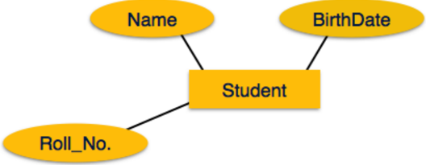

If the attributes are composite , they are further divided in a tree like structure. Every node is then connected to its attribute. That is, composite attributes are represented by ellipses that are connected with an ellipse.

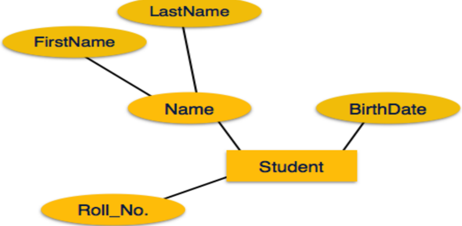

Multivalued attributes are depicted by double ellipse.

## DBMS (DI04032011)

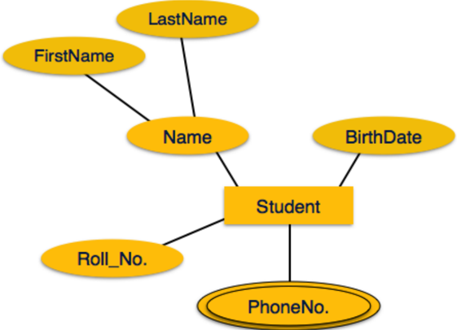

Derived attributes are depicted by dashed ellipse.

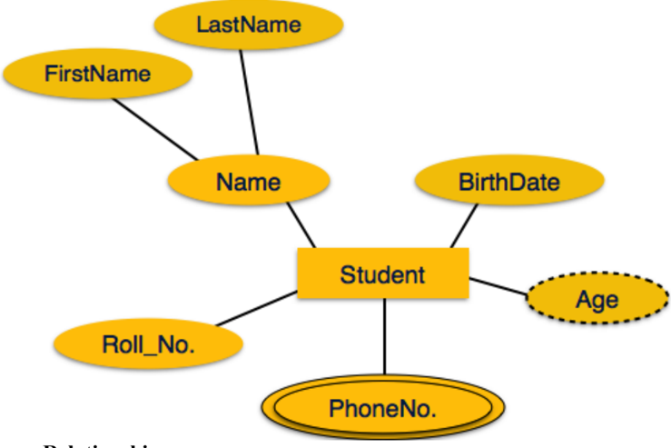

## Relationship

Relationships  are  represented  by  diamond-shaped  box.  Name  of  the  relationship  is  written  inside  the diamond-box. All the entities (rectangles) participating in a relationship, are connected to it by a line.

## Binary Relationship and Cardinality

A relationship  where  two  entities  are  participating  is  called  a binary  relationship .  Cardinality  is  the number of instance of an entity from a relation that can be associated with the relation.

-  One-to-one - When only one instance of an entity is associated with the relationship, it is marked as '1:1'. The following image reflects that only one instance of each entity should be associated with the relationship. It depicts one-to-one relationship.

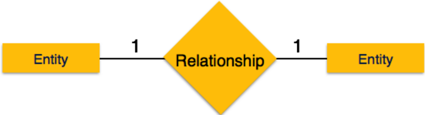

-  One-to-many - When more than one instance of an entity is associated with a relationship, it is marked as '1:N'. The following image reflects that only one instance of entity on the left and more than one instance of an entity on the right can be associated with the relationship. It depicts one-to-many relationship.
-  Many-to-one - When more than one instance of entity is associated with the relationship, it is marked as 'N:1'. The following image reflects that more than one instance of an entity on the left and only one instance of an entity on the right can be associated with the relationship. It depicts many-to-one relationship.
-  Many-to-many - The following image reflects that more than one instance of an entity on the  left  and  more  than  one  instance  of  an  entity  on  the  right  can  be  associated  with  the relationship. It depicts many-to-many relationship.
-  Total  Participation -  Each  entity  is  involved  in  the  relationship.  Total  participation  is represented by double lines.

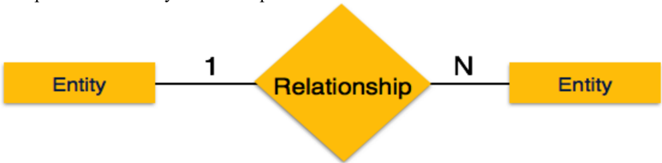

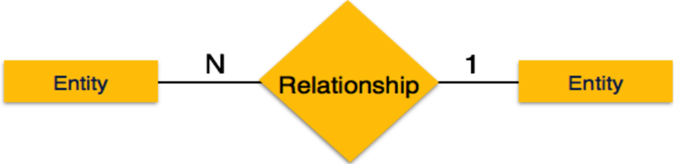

Participation Constraints

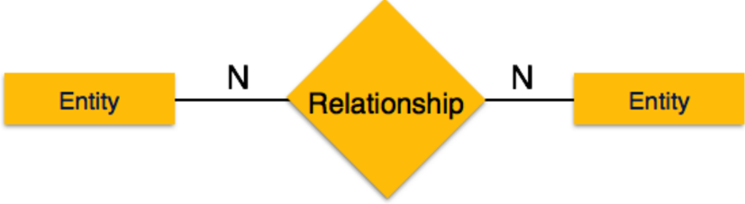

-  Partial participation - Not all entities are involved in the relationship. Partial participation is represented by single lines.

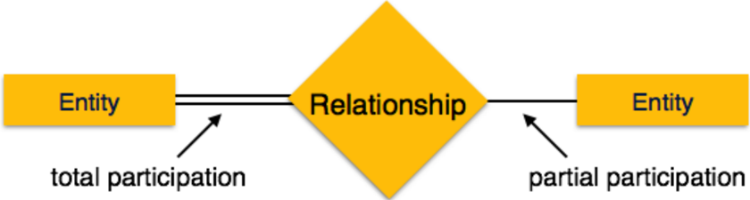

## Normalization

-  Normalization is the process of organizing the data in the database.
-  Normalization is used to minimize the redundancy from a relation or set of relations. It is also used to eliminate undesirable characteristics like Insertion, Update, and Deletion Anomalies.
-  Normalization divides the larger table into smaller and links them using relationships.
-  The normal form is used to reduce redundancy from the database table.

The main reason for normalizing the relations is removing these anomalies. Failure to eliminate anomalies leads  to  data  redundancy  and  can  cause  data  integrity  and  other  problems  as  the  database  grows. Normalization consists of a series of guidelines that helps to guide you in creating a good database structure.

## Data modification anomalies can be categorized into three types:

-  Insertion Anomaly: Insertion Anomaly refers to when one cannot insert a new tuple into a relationship due to lack of data.
-  Deletion Anomaly: The delete anomaly refers to the situation where the deletion of data results in the unintended loss of some other important data.
-  Updatation Anomaly: The update anomaly is when an update of a single data value requires multiple rows of data to be updated.

## Types of Normal Forms:

| Normal  Form   | Description                                                                                                              |
|----------------|--------------------------------------------------------------------------------------------------------------------------|
| 1NF            | A relation is in 1NF if it contains an atomic value.                                                                     |
| 2NF            | A relation will be in 2NF if it is in 1NF and all non-key attributes are fully functional dependent  on the primary key. |
| 3NF            | A relation will be in 3NF if it is in 2NF and no transition dependency exists.                                           |
| BCNF           | A stronger definition of 3NF is known as Boyce Codd's normal form.                                                       |
| 4NF            | A  relation  will  be  in  4NF  if  it  is  in  Boyce  Codd's  normal  form  and  has  no  multi-valued                  |

## DBMS (DI04032011)

|     | dependency.                                                                                                   |
|-----|---------------------------------------------------------------------------------------------------------------|
| 5NF | A relation is in 5NF. If it is in 4NF and does not contain any join dependency,   joining should be lossless. |

## N. Resources/Equipment Required

Computer or laptop with a database management system (DBMS) software installed, such as Oracle

## O. Safety and necessary Precautions followed

Shutdown computer system properly once the Lab hours are finished

## P. Solution

## DBMS (DI04032011)

## DBMS (DI04032011)

## Q. Practical related Quiz.

1. What is an E-R diagram?
- A. A diagram that shows the relationships between tables in a database.
- B. A diagram that shows the relationships between entities in a system.
- C. A diagram that shows the relationships between data types in a programming language.
- D. None of the above.
2. What is an entity in an E-R diagram?
- A. A table in a database.
- B. A column in a table.
- C. A person, place, thing, or event in a system.
- D. None of the above.
3. What is a relationship in an E-R diagram?
- A. A connection between two tables in a database.
- B. A connection between two columns in a table.
- C. A connection between two entities in a system.
- D. None of the above.
4. What is normalization in database design?
- A. The process of organizing data into tables to minimize redundancy and ensure data integrity.
- B. The process of organizing tables into databases to minimize redundancy and ensure data integrity.
- C. The process of optimizing database performance by creating indexes and views.
- D. None of the above.
5. What is the purpose of normal forms in database design?
- A. To ensure that data is stored in the most efficient way possible.
- B. To ensure that data is stored in a way that is easy to query and maintain.
- C. To ensure that data is stored in a way that is free from errors and inconsistencies.
- D. All of the above.
6. What is first normal form (1NF)?
- A. A table is in 1NF if it has a primary key and all its columns are atomic.
- B. A table is in 1NF if it has a primary key and all its columns are of the same data type.
- C. A table is in 1NF if it has a primary key and all its columns are unique.
- D. None of the above.
7. What is second normal form (2NF)?

## DBMS (DI04032011)

- A. A table is in 2NF if it is in 1NF and all its non-key columns are fully dependent on the primary key.
- B. A table is in 2NF if it is in 1NF and all its columns are of the same data type.
- C. A table is in 2NF if it is in 1NF and all its columns are unique.
- D. None of the above.
8. What is third normal form (3NF)?
- A. A table is in 3NF if it is in 2NF and all its non-key columns are non-transitively dependent on the primary key.
- B. A table is in 3NF if it is in 2NF and all its columns are of the same data type.
- C. A table is in 3NF if it is in 2NF and all its columns are unique.
- D. None of the above.

## R. References / Suggestions

https://www.geeksforgeeks.org/ddl-commands-syntax/

https://www.w3schools.com/sql/

https://www.tutorialspoint.com/sql/index.htm

## S. Assessment-Rubrics

| Excellent  (18-20  Marks)                                                                                                | Good (13-17 Marks)                                                                                                                                   | Satisfactory  (7-12  Marks)                                                                                                   | Fair (0-6 Marks)                                                                                                          |
|--------------------------------------------------------------------------------------------------------------------------|------------------------------------------------------------------------------------------------------------------------------------------------------|-------------------------------------------------------------------------------------------------------------------------------|---------------------------------------------------------------------------------------------------------------------------|
|  Student  executes  the  queries  with  correct output.    Student submits  the lab report in  specified  time  limit. |  Student executes the  queries  having  correct  output  with  external guidance.    Student  submits  the  lab  report  in  specified time limit. |  Student executes  the  queries  with  incorrect output.    Student  submits  the  lab  report  in  specified  time  limit. |  Student is not able to  execute the queries.    Student  does  not  submit the lab report  in  specified  time  limit. |

Sign with Date

## Practical No.14:

Perfom TCL and DCL commands table created in Practical 3.

## A. Objective:

-  TCL  commands  are  used  to  manage  transactions  in  SQL  databases,to  commit  a transaction and permanently save the changes made during the transaction and to roll back a transaction and undo any changes made during the transaction
-  DCL commands are used to manage user permissions and access to the database, to grant or revoke privileges to users or roles for specific database objects

, to create or drop user accounts and manage user authentication

## B. Expected Program Outcomes (POs):

1. Basic and Discipline specific knowledge: Apply knowledge of basic mathematics, science and engineering fundamentals and engineering specialization to solve the Computer Engineering problems.
2. Problem analysis: Identify and analyse well-defined Computer Engineering problems using codified standard methods.
3. Design/development of solutions: Design solutions for Computer Engineering welldefined technical problems and assist with the design of systems components or processes to meet specified needs.
4. Engineering Tools, Experimentation and Testing: Apply modern Computer Engineering tools and appropriate technique to conduct standard tests and measurements.
5. Life-long learning: Ability to analyse individual needs and engage in updating in the context of technological changes in field of engineering.

## C. Expected Skills to be developed based on competency:

C ompilation, debugging, executing SQL queries

## D. Expected Course Outcomes(Cos)

E.

Perform queries on datasets using SQL*Plus

## E. Practical Outcome(PRo)

Write data definition queries , compilation, debugging, executing using SQL

## F. Expected Affective domain Outcome (ADos)

-  Follow safety practices.

Date: ……………

## DBMS (DI04032011)

-  Practice good housekeeping.
-  Demonstrate working as a leader/a team member.
-  Maintain tools and equipment
-  Follow ethical practices.

## G. Prerequisite Theory:

- ORACLE installation
- Syntax of DDL Commands

## TCL Commands in SQL- Transaction Control Language Examples:

Transaction Control Language can be defined as the portion of a database language used for maintaining consistency of the database and managing transactions in database. A set of SQL statements that are corelated logically and executed on the data stored in the table is known as transaction. In this tutorial, you will learn different TCL Commands in SQL with examples and difference between them.

2. Commit Command
3. Rollback Command
4. Savepoint Command

## Commit Commands:

The main use of Commit command is to make the changes done by the transaction permanent in the database.

## Syntax: COMMIT;

## Example:

UPDATE STUDENT SET STUDENT\_NAME = 'Maria' WHERE STUDENT\_NAME = 'Meena';

## COMMIT;

By using the above set of instructions, you can update the wrong student name by the correct one and save it permanently in the database. The update transaction gets completed when commit is used. If commit is not used, then there will be lock on 'Meena' record till the rollback or commit is issued.

Now have a look at the below diagram where 'Meena' is updated and there is a lock on her record. The updated value is permanently saved in the database after the use of commit and lock is released.

|   Student ID | Student Name   |
|--------------|----------------|
|           78 | Jane           |
|           79 | Meena          |

## DBMS (DI04032011)

## After Update :

|   Student ID | Student Name   |
|--------------|----------------|
|           78 | Jane           |
|           79 | Maria          |

## After Commit :

|   Student ID | Student Name   |
|--------------|----------------|
|           78 | Jane           |
|           79 | Maria          |

## Rollback:

Using this command, the database can be restored to the last committed state. Additionally, it is also used with savepoint command for jumping to a savepoint in a transaction.

Syntax:

ROLLBACK;

## OR

ROLLBACK TO SAVEPOINT\_NAME;

Example:

## UPDATE STUDENT SET STUDENT\_NAME = 'Manish' WHERE STUDENT\_NAME = 'Meena';

## ROLLBACK;

This command is used when the user realizes that he/she has updated the wrong information and wants to undo this update. The users can issue ROLLBACK command and then undo the update. Have a look at the below tables to know better about the implementation of this command.

|   Student ID | Student Name   |
|--------------|----------------|
|           78 | Jane           |
|           79 | Meena          |

## After Update :

|   Student ID | Student Name   |
|--------------|----------------|
|           78 | Jane           |
|           79 | Manish         |

## After Rollback:

|   Student ID | Student Name   |
|--------------|----------------|
|           78 | Jane           |
|           79 | Meena          |

## Savepoint:

The main use of the Savepoint command is to save a transaction temporarily. This way users can rollback to the point whenever it is needed.

Syntax: SAVEPOINT SAVEPOINT\_NAME;

## DBMS (DI04032011)

## Example:

## SAVEPOINT SAVEPOINT\_NAME;

## Following is the table of a school class

|   ID | Name    |
|------|---------|
|   98 | Anita   |
|   99 | Maria   |
|  100 | Katilyn |

## Use some SQL queries on the above table and then watch the results

INSERT into CLASS VALUES (101, 'Rahul);

Commit;

UPDATE CLASS SET NAME= 'Tyler' where id= 101;

SAVEPOINT A;

INSERT INTO CLASS VALUES (102, 'Zack');

Savepoint B;

INSERT INTO CLASS VALUES (103, 'Bruno')

Savepoint C;

SELECT * FROM CLASS;

The result will look like

|   ID | Name    |
|------|---------|
|   98 | Anita   |
|   99 | Maria   |
|  100 | Katilyn |
|  101 | Tyler   |
|  102 | Zack    |
|  103 | Bruno   |

## Now rollback to savepoint B

ROLLBACK TO B;

SELECT * FROM CLASS;

|   ID | Name    |
|------|---------|
|   98 | Anita   |
|   99 | Maria   |
|  100 | Katilyn |
|  101 | Tyler   |
|  102 | Zack    |

## Now rollback to savepoint A

ROLLBACK TO A; SELECT * FROM CLASS;

## DCL Commands

## Create user -

If a login ID does not exist, it has to be created manually. The following steps indicate how a DBA login ID is created and appropriate privileges given to the DBA login ID with a special focus on creating table space.

## Creating a User:-

SYNTAX: CREATE USER USERNAME IDENTIFIED BY PASSWORD;

## Example:-

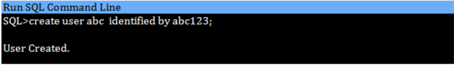

When we create a user in SQL, it is not even allowed to login and create a session until and unless proper permissions/privileges are granted to the user.

Following command can be used to grant the session creating privileges.

SYNTAX: -

GRANT CREATE SESSION, connect, resource TO username;

Unlocking a user account:-

SYNTAX: ALTER USER account IDENTIFIED BY password ACCOUNT UNLOCK;

## DCL Commands

Oracle provides two commands - GRANT and REVOKE - to control the access of various database objects.

## GRANT COMMAND

Grants a privilege to a user. It means that giving authority to other user by administrator. If you are an administrator then only you have the authority for granting the privilege to other users. User can grant

|   ID | Name    |
|------|---------|
|   98 | Anita   |
|   99 | Maria   |
|  100 | Katilyn |
|  101 | Tyler   |

privilege only if user has been granted that privilege

Syntax  : GRANT  &lt;  OBJECT  PRIVILEGES  &gt;  ON  &lt;OBJECTNAME&gt;  TO  &lt;USERNAME&gt;  [WITH GRANT OPTION];

## OBJECT PRIVILEGES

Each object privilege that is granted authorizes the grantee to perform some operation on the object. A user can grant all the privileges or grant only specific object privileges.

The list of object privileges is as follows:

ALTER: Allows the grantee to change the table definition with the ALTER TABLE command DELETE: Allows the grantee to remove the records from the table with the DELETE command INDEX: Allows the grantee to create an index on the table with the CREATE INDEX command INSERT: Allows the grantee to add records to the table with the INSERT command SELECT: Allows the grantee to query the table with the SELECT command UPDATE: Allows the grantee to modify the records in the tables with the UPDATE command

Example:

Give the user rahul permission to only view and modify records in the table client\_master.

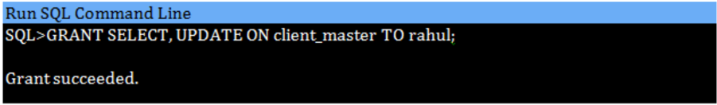

## REVOKE COMMAND

The REVOKE statement is used to deny the grant given on an object. Revokes a privilege from a user. It is used in getting back authority from user.

Syntax: REVOKE &lt; OBJECT PRIVILEGES &gt; ON &lt;OBJECT NAME&gt; FROM &lt;USERNAME&gt;;

## Example:

All privileges on the table salesman\_master have been granted to rahul. Take back the Delete privilege on the table.

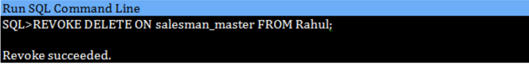

## H. Resources/Equipment Required

Computer or laptop with a database management system (DBMS) software installed, such as Oracle

## I. Safety and necessary Precautions followed

Shutdown computer system properly once the Lab hours are finished

DBMS (DI04032011)

- J. Source code / Solutions to queries:

## DBMS (DI04032011)

## K. Practical related Quiz.

1. Command that comes under DCL is/are -
- A. GRANT
- B. REVOKE
- C. Both A. and B.
- D. None of the above
2. Following the completion of a transaction, it must be executed to save all the operations performed in the transaction. Here we are talking about which command?
- A. REVOKE
- B. COMMIT
- C. ROLLBACK
- D. SAVE

## 3. Difference between GRAND &amp; REVOKE command is/are?

- L. The GRANT command can be used to grant a user access to databases and tables whereas The REVOKE command can be used to revoke all access privileges already assigned to the user.
- M. The REVOKE command can be used to grant a user access to databases and tables whereas The GRANT command can be used to revoke all access privileges already assigned to the user.
- N. A transaction can be rolled back to its last saved state.
- O. None of the above
5. Which of the following is TRUE about TCL?
- A. Transactions can be saved to the database and rolled back with the help of TCL commands in SQL.
- B. There will be certain privileges that each user has; consequently, the data can be accessed by them using TCL.
- C. Our data is stored in a table that is described by the schema, thus TCL commands deal with the schema.
- D. SQL TCL commands can be used to perform any kind of retrieval or manipulation of the data present in SQL tables.
5. \_\_\_\_\_\_\_\_\_commands in SQL allow controlling access to data within database.
- A. Database
- B. Data
- C. Data control
- D. All of the Mentioned

## L. References / Suggestions ( lab manual designer should give)

https://www.geeksforgeeks.org/ddl-commands-syntax/

## https://www.w3schools.com/sql/ https://www.tutorialspoint.com/sql/index.htm

## M. Assessment-Rubrics

| Excellent  (18-20  Marks)                                                                                                | Good (13-17 Marks)                                                                                                                                   | Satisfactory  (7-12  Marks)                                                                                                   | Fair (0-6 Marks)                                                                                                          |
|--------------------------------------------------------------------------------------------------------------------------|------------------------------------------------------------------------------------------------------------------------------------------------------|-------------------------------------------------------------------------------------------------------------------------------|---------------------------------------------------------------------------------------------------------------------------|
|  Student  executes  the  queries  with  correct output.    Student submits  the lab report in  specified  time  limit. |  Student executes the  queries  having  correct  output  with  external guidance.    Student  submits  the  lab  report  in  specified time limit. |  Student executes  the  queries  with  incorrect output.    Student  submits  the  lab  report  in  specified  time  limit. |  Student is not able to  execute the queries.    Student  does  not  submit the lab report  in  specified  time  limit. |

## Sign with Date