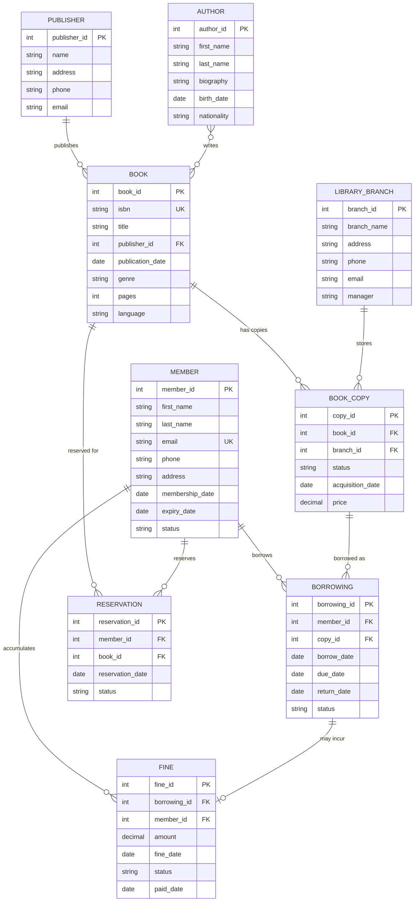
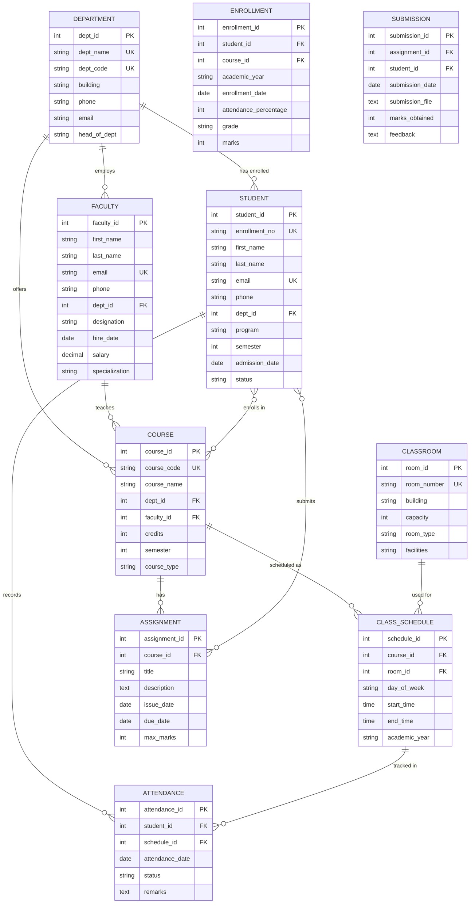

# Practical 2: Design ER Diagram for Library Management System and Convert to Relational Schema

## Objective

- E-R diagrams provide a high-level view of the database's purpose and requirements
- ER diagrams provide a detailed view of the database's structure and relationships
- To reduce data redundancy, minimize data inconsistencies, and improve database performance
- By following normalization principles, create databases that are organized, efficient, and maintainable

## Course Outcomes

- **CO2**: Design database using Entity Relationship approach
- **CO4**: Apply concepts of normalization to design an optimal database

## Practical Outcomes

- Understand how E-R diagrams are used in data modeling, database design, communication, maintenance, and optimization
- Learn how normalization improves efficiency, consistency, flexibility, and database maintenance

## Files

- **pr2.sql** - Oracle implementation of Library and College Management systems
- **pr2_sqlite.sql** - SQLite implementation of Library and College Management systems

---

## Entity Relationship Model Theory

The Entity Relational Model is a model for identifying entities to be represented in the database and the relationships between those entities. The ER data model specifies the enterprise schema that represents the overall logical structure of a database graphically.

### ER Model Components

#### 1. Entity

Entities are represented by rectangles. An entity is an object or concept that has data stored about it.

**Entity Types:**

- **Strong Entity**: Has its own primary key (e.g., Student, Book)
- **Weak Entity**: Depends on another entity for identification (shown with double rectangle)

#### 2. Attributes

Attributes are the properties of entities, represented by ellipses connected to their entity.

**Attribute Types:**

- **Simple Attribute**: Cannot be subdivided (e.g., age, ISBN)
- **Composite Attribute**: Can be subdivided (e.g., name → first name, last name)
- **Multi-valued Attribute**: Can have multiple values (shown with double ellipse, e.g., phone numbers)
- **Derived Attribute**: Calculated from other attributes (shown with dashed ellipse, e.g., age from birth date)
- **Key Attribute**: Uniquely identifies an entity (underlined)

#### 3. Relationships

Relationships are represented by diamond-shaped boxes connecting related entities.

**Cardinality Types:**

- **One-to-One (1:1)**: One instance of Entity A relates to one instance of Entity B
- **One-to-Many (1:N)**: One instance of Entity A relates to many instances of Entity B
- **Many-to-One (N:1)**: Many instances of Entity A relate to one instance of Entity B
- **Many-to-Many (M:N)**: Many instances of Entity A relate to many instances of Entity B

**Participation Constraints:**

- **Total Participation**: Every entity must participate (shown with double line)
- **Partial Participation**: Entity may or may not participate (shown with single line)

---

## System 1: Library Management System

### ER Diagram



### Entities and Relationships

#### Entities

1. **PUBLISHER** - Publishing companies that produce books
2. **AUTHOR** - Authors who write books
3. **BOOK** - Books available in the library (catalog entries)
4. **BOOK_COPY** - Physical copies of books (can have multiple copies)
5. **LIBRARY_BRANCH** - Different library locations
6. **MEMBER** - Library members who can borrow books
7. **BORROWING** - Records of books borrowed by members
8. **RESERVATION** - Book reservations when copies are unavailable
9. **FINE** - Fines for late returns or damaged books

#### Relationships

1. **Publisher PUBLISHES Book** (1:N)
   - One publisher can publish many books
   - Each book is published by one publisher

2. **Author WRITES Book** (M:N)
   - One author can write many books
   - One book can have multiple authors (co-authors)
   - Requires junction table in implementation

3. **Book HAS Book_Copy** (1:N)
   - One book catalog entry can have many physical copies
   - Each copy belongs to one book

4. **Library_Branch STORES Book_Copy** (1:N)
   - One branch stores many book copies
   - Each copy is stored at one branch

5. **Member BORROWS Book_Copy** (1:N through Borrowing)
   - One member can have many borrowings
   - Each borrowing is by one member

6. **Book_Copy IS_BORROWED_AS Borrowing** (1:N)
   - One book copy can have many borrowing records over time
   - Each borrowing is for one specific copy

7. **Member RESERVES Book** (1:N through Reservation)
   - One member can make many reservations
   - Each reservation is by one member

8. **Book IS_RESERVED_FOR Reservation** (1:N)
   - One book can have many reservations
   - Each reservation is for one book

9. **Borrowing INCURS Fine** (1:1 optional)
   - One borrowing may incur at most one fine
   - Fine tracks late fees

10. **Member ACCUMULATES Fine** (1:N)
    - One member can have many fines
    - Each fine belongs to one member

### Relational Schema

**PUBLISHER**(<u>publisher_id</u>, name, address, phone, email)

**AUTHOR**(<u>author_id</u>, first_name, last_name, biography, birth_date, nationality)

**BOOK**(<u>book_id</u>, isbn, title, publisher_id, publication_date, genre, pages, language)

- FOREIGN KEY (publisher_id) REFERENCES PUBLISHER(publisher_id)
- UNIQUE (isbn)

**BOOK_AUTHOR**(<u>book_id, author_id</u>)

- FOREIGN KEY (book_id) REFERENCES BOOK(book_id)
- FOREIGN KEY (author_id) REFERENCES AUTHOR(author_id)
- *Junction table for M:N relationship*

**LIBRARY_BRANCH**(<u>branch_id</u>, branch_name, address, phone, email, manager)

**BOOK_COPY**(<u>copy_id</u>, book_id, branch_id, status, acquisition_date, price)

- FOREIGN KEY (book_id) REFERENCES BOOK(book_id)
- FOREIGN KEY (branch_id) REFERENCES LIBRARY_BRANCH(branch_id)

**MEMBER**(<u>member_id</u>, first_name, last_name, email, phone, address, membership_date, expiry_date, status)

- UNIQUE (email)

**BORROWING**(<u>borrowing_id</u>, member_id, copy_id, borrow_date, due_date, return_date, status)

- FOREIGN KEY (member_id) REFERENCES MEMBER(member_id)
- FOREIGN KEY (copy_id) REFERENCES BOOK_COPY(copy_id)

**RESERVATION**(<u>reservation_id</u>, member_id, book_id, reservation_date, status)

- FOREIGN KEY (member_id) REFERENCES MEMBER(member_id)
- FOREIGN KEY (book_id) REFERENCES BOOK(book_id)

**FINE**(<u>fine_id</u>, borrowing_id, member_id, amount, fine_date, status, paid_date)

- FOREIGN KEY (borrowing_id) REFERENCES BORROWING(borrowing_id)
- FOREIGN KEY (member_id) REFERENCES MEMBER(member_id)

---

## System 2: College Management System

### ER Diagram



### Entities and Relationships

#### Entities

1. **DEPARTMENT** - Academic departments (e.g., Computer Science, Mechanical)
2. **FACULTY** - Professors and instructors
3. **STUDENT** - Students enrolled in the college
4. **COURSE** - Courses offered by departments
5. **ENROLLMENT** - Student enrollment in courses (with grades)
6. **CLASSROOM** - Physical classrooms and labs
7. **CLASS_SCHEDULE** - Class timings and room allocation
8. **ASSIGNMENT** - Assignments/projects for courses
9. **SUBMISSION** - Student assignment submissions
10. **ATTENDANCE** - Student attendance records

#### Relationships

1. **Department HAS Student** (1:N)
   - One department has many students
   - Each student belongs to one department

2. **Department EMPLOYS Faculty** (1:N)
   - One department employs many faculty members
   - Each faculty member works in one department

3. **Department OFFERS Course** (1:N)
   - One department offers many courses
   - Each course is offered by one department

4. **Faculty TEACHES Course** (1:N)
   - One faculty member can teach many courses
   - Each course is taught by one faculty member

5. **Student ENROLLS_IN Course** (M:N through Enrollment)
   - One student can enroll in many courses
   - One course can have many students enrolled
   - Enrollment stores grades and attendance

6. **Course SCHEDULED_AS Class_Schedule** (1:N)
   - One course can have multiple class schedules (different days/times)
   - Each schedule belongs to one course

7. **Classroom USED_FOR Class_Schedule** (1:N)
   - One classroom can be used for many class schedules
   - Each schedule uses one classroom

8. **Course HAS Assignment** (1:N)
   - One course can have many assignments
   - Each assignment belongs to one course

9. **Student SUBMITS Assignment** (M:N through Submission)
   - One student can submit many assignments
   - One assignment can have many submissions (one per student)
   - Submission tracks marks and feedback

10. **Student RECORDS Attendance** (1:N)
    - One student has many attendance records
    - Each attendance record belongs to one student

11. **Class_Schedule TRACKED_IN Attendance** (1:N)
    - One class schedule can have many attendance records
    - Each attendance record is for one class schedule

### Relational Schema

**DEPARTMENT**(<u>dept_id</u>, dept_name, dept_code, building, phone, email, head_of_dept)

- UNIQUE (dept_name)
- UNIQUE (dept_code)

**FACULTY**(<u>faculty_id</u>, first_name, last_name, email, phone, dept_id, designation, hire_date, salary, specialization)

- FOREIGN KEY (dept_id) REFERENCES DEPARTMENT(dept_id)
- UNIQUE (email)

**STUDENT**(<u>student_id</u>, enrollment_no, first_name, last_name, email, phone, dept_id, program, semester, admission_date, status)

- FOREIGN KEY (dept_id) REFERENCES DEPARTMENT(dept_id)
- UNIQUE (enrollment_no)
- UNIQUE (email)

**COURSE**(<u>course_id</u>, course_code, course_name, dept_id, faculty_id, credits, semester, course_type)

- FOREIGN KEY (dept_id) REFERENCES DEPARTMENT(dept_id)
- FOREIGN KEY (faculty_id) REFERENCES FACULTY(faculty_id)
- UNIQUE (course_code)

**ENROLLMENT**(<u>enrollment_id</u>, student_id, course_id, academic_year, enrollment_date, attendance_percentage, grade, marks)

- FOREIGN KEY (student_id) REFERENCES STUDENT(student_id)
- FOREIGN KEY (course_id) REFERENCES COURSE(course_id)
- UNIQUE (student_id, course_id, academic_year)
- *Junction table with additional attributes*

**CLASSROOM**(<u>room_id</u>, room_number, building, capacity, room_type, facilities)

- UNIQUE (room_number)

**CLASS_SCHEDULE**(<u>schedule_id</u>, course_id, room_id, day_of_week, start_time, end_time, academic_year)

- FOREIGN KEY (course_id) REFERENCES COURSE(course_id)
- FOREIGN KEY (room_id) REFERENCES CLASSROOM(room_id)

**ASSIGNMENT**(<u>assignment_id</u>, course_id, title, description, issue_date, due_date, max_marks)

- FOREIGN KEY (course_id) REFERENCES COURSE(course_id)

**SUBMISSION**(<u>submission_id</u>, assignment_id, student_id, submission_date, submission_file, marks_obtained, feedback)

- FOREIGN KEY (assignment_id) REFERENCES ASSIGNMENT(assignment_id)
- FOREIGN KEY (student_id) REFERENCES STUDENT(student_id)
- UNIQUE (assignment_id, student_id)
- *Junction table with additional attributes*

**ATTENDANCE**(<u>attendance_id</u>, student_id, schedule_id, attendance_date, status, remarks)

- FOREIGN KEY (student_id) REFERENCES STUDENT(student_id)
- FOREIGN KEY (schedule_id) REFERENCES CLASS_SCHEDULE(schedule_id)

---

## Normalization Applied

Both systems follow normalization principles:

### First Normal Form (1NF)

- All attributes contain atomic values
- No repeating groups
- Each table has a primary key

### Second Normal Form (2NF)

- Meets 1NF requirements
- No partial dependencies (all non-key attributes fully depend on primary key)
- Junction tables (BOOK_AUTHOR, ENROLLMENT, SUBMISSION) properly handle M:N relationships

### Third Normal Form (3NF)

- Meets 2NF requirements
- No transitive dependencies
- Foreign keys properly reference primary keys
- No calculated/derived attributes stored (e.g., age calculated from birth_date)

---

## Sample Queries

### Library Management System

```sql
-- Find all books written by a specific author
SELECT B.title, B.isbn, P.name AS publisher
FROM BOOK B
JOIN BOOK_AUTHOR BA ON B.book_id = BA.book_id
JOIN AUTHOR A ON BA.author_id = A.author_id
JOIN PUBLISHER P ON B.publisher_id = P.publisher_id
WHERE A.last_name = 'Rowling';

-- List all currently borrowed books at a specific branch
SELECT M.first_name, M.last_name, B.title, BR.borrow_date, BR.due_date
FROM BORROWING BR
JOIN MEMBER M ON BR.member_id = M.member_id
JOIN BOOK_COPY BC ON BR.copy_id = BC.copy_id
JOIN BOOK B ON BC.book_id = B.book_id
JOIN LIBRARY_BRANCH LB ON BC.branch_id = LB.branch_id
WHERE LB.branch_name = 'Main Branch'
  AND BR.status = 'active';

-- Find members with outstanding fines
SELECT M.member_id, M.first_name, M.last_name, SUM(F.amount) AS total_fines
FROM MEMBER M
JOIN FINE F ON M.member_id = F.member_id
WHERE F.status = 'unpaid'
GROUP BY M.member_id, M.first_name, M.last_name
HAVING SUM(F.amount) > 0;
```

### College Management System

```sql
-- List all students enrolled in a specific course
SELECT S.enrollment_no, S.first_name, S.last_name, E.grade, E.marks
FROM STUDENT S
JOIN ENROLLMENT E ON S.student_id = E.student_id
JOIN COURSE C ON E.course_id = C.course_id
WHERE C.course_code = 'CS101'
  AND E.academic_year = '2024-25';

-- Find faculty teaching schedule for a specific day
SELECT F.first_name, F.last_name, C.course_name, 
       CS.start_time, CS.end_time, CL.room_number
FROM FACULTY F
JOIN COURSE C ON F.faculty_id = C.faculty_id
JOIN CLASS_SCHEDULE CS ON C.course_id = CS.course_id
JOIN CLASSROOM CL ON CS.room_id = CL.room_id
WHERE CS.day_of_week = 'Monday'
ORDER BY CS.start_time;

-- Calculate attendance percentage for a student
SELECT S.enrollment_no, S.first_name, S.last_name,
       COUNT(CASE WHEN A.status = 'present' THEN 1 END) * 100.0 / COUNT(*) AS attendance_percentage
FROM STUDENT S
JOIN ATTENDANCE A ON S.student_id = A.student_id
GROUP BY S.student_id, S.enrollment_no, S.first_name, S.last_name;

-- List pending assignments for a student
SELECT C.course_name, A.title, A.due_date, A.max_marks
FROM ASSIGNMENT A
JOIN COURSE C ON A.course_id = C.course_id
JOIN ENROLLMENT E ON C.course_id = E.course_id
WHERE E.student_id = 1
  AND NOT EXISTS (
    SELECT 1 FROM SUBMISSION S 
    WHERE S.assignment_id = A.assignment_id 
      AND S.student_id = E.student_id
  )
  AND A.due_date >= SYSDATE;
```

---

## Implementation Notes

### Foreign Key Constraints

All foreign keys implement referential integrity:

- **ON DELETE CASCADE**: Used for dependent records (e.g., deleting a book deletes its copies)
- **ON DELETE SET NULL**: Used for optional relationships (e.g., faculty leaves, course faculty_id set to NULL)
- **ON DELETE RESTRICT**: Used to prevent deletion when records exist (e.g., cannot delete publisher if books exist)

### Check Constraints

- Status fields constrained to specific values
- Date validations (e.g., due_date > borrow_date)
- Numeric constraints (e.g., credits > 0, capacity > 0)
- Email format validation

### Indexes

Recommended indexes for performance:

- Foreign key columns
- Frequently searched columns (email, enrollment_no, course_code)
- Date columns used in range queries

---

## References

1. [Database System Concepts - Silberschatz, Korth, Sudarshan](https://www.db-book.com/)
2. [W3Schools SQL Tutorial](https://www.w3schools.com/sql/)
3. [GeeksforGeeks DBMS](https://www.geeksforgeeks.org/dbms/)
4. [TutorialsPoint DBMS](https://www.tutorialspoint.com/dbms/)
5. [Oracle Database Documentation](https://docs.oracle.com/en/database/)
6. [PostgreSQL Documentation](https://www.postgresql.org/docs/)

---

## Lab Exercises

1. Draw the ER diagram for Library Management System on paper
2. Convert the ER diagram to relational schema
3. Identify all foreign keys and their relationships
4. Execute the provided SQL scripts (pr2.sql or pr2_sqlite.sql)
5. Insert sample data for at least:
   - 3 departments
   - 5 faculty members
   - 10 students
   - 8 courses
   - 15 enrollments
6. Write and execute queries to:
   - List all students in a specific department
   - Find courses taught by a specific faculty
   - Calculate average marks for a course
   - Generate a class schedule for a specific classroom
7. Repeat the same for College Management System

---

*This practical demonstrates the complete process of database design from conceptual modeling (ER diagram) to logical design (relational schema) to physical implementation (SQL scripts).*
